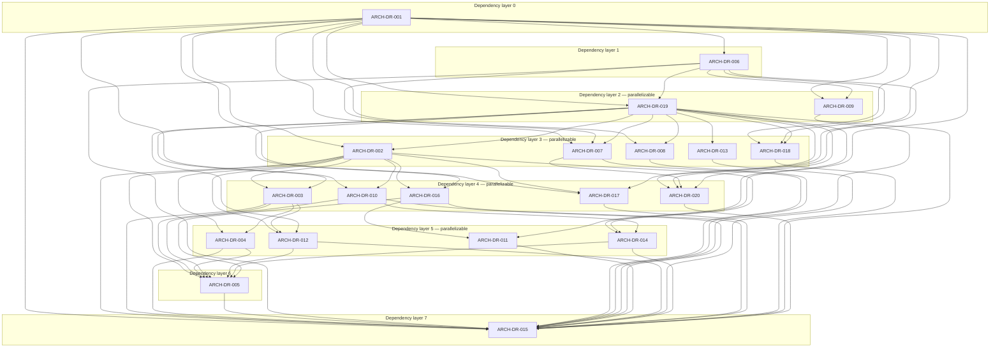

# Engineering Convergence Assessment

## 1. Executive Summary

**Statement category:** Finding.

The repository is a substantial pre-alpha engineering platform. It contains
repository-local implementations for engineering management, operator
control, mission and WOP handling, authority publication and evaluation,
admission, supervised execution, evidence, qualification, reconciliation,
synchronization, and durable notification. Those capabilities are supported
by schemas, fail-closed controls, tests, and focused evidence.

The repository is not yet architecturally converged or publication-stable.
The preserved assessment found plural authority-evaluation paths, two editable
Mission Contract-like stores, reachable legacy gate dependencies, repeated
current-state facts, and a large body of working-tree-only capability. These
conditions create ambiguity and reproducibility risk even though functional
breadth is high.

At the assessed boundary, the canonical Progressive Operational Alpha package
recorded OA-01 through OA-05 as `ACCEPTED`, OA-06 as
`IMPLEMENTATION_REQUIRED`, and OA-07 through OA-30 as `PENDING`. Operational
dispatch was disabled. Operational Alpha declaration and baseline freeze had
not occurred.

The central engineering problem is convergence, not greenfield platform
construction. The preserved evidence supports reuse of existing downstream
capabilities, but it does not decide component ownership, authority topology,
terminal decision ownership, compatibility disposition, or state ownership.
Those selections are expressed in this assessment only as Decision Requests
for ADR-0001.

| Dimension | Assessment | Confidence |
|---|---|---|
| Functional breadth | High | Verified |
| Production maturity | Medium-low | Strongly Supported |
| Architecture convergence | Partial | Strongly Supported |
| Test breadth | Medium-high | Verified |
| Aggregate reproducibility | Not established | Verified |
| Documentation volume | High | Verified |
| Documentation convergence | Medium | Strongly Supported |
| Repository health | At risk from unpublished working-tree state | Verified |
| Operational Alpha readiness | Partial; not ready to declare | Verified |

Draft 1.6 is content-complete as an engineering assessment candidate for
ADR-0001. It remains Draft with approval and persistence Pending. Content
readiness does not approve ARCH-0001, decide architecture, authorize
implementation, advance mission state, or grant authority to its downstream
documents.

## 2. Assessment Charter

**Statement category:** Observation.

### 2.1 Purpose

ARCH-0001 converts the preserved `ENGINEERING-CONVERGENCE-REVIEW-001` report
set into a coherent controlled engineering assessment. Its purposes are to:

- state the repository condition that was assessed;
- preserve material observations and conclusions from the historical review;
- evaluate capability breadth and maturity consistently;
- identify duplicate, obsolete, and transitional work;
- assess runtime, documentation, repository, and Operational Alpha
  convergence;
- state engineering risks and nonbinding engineering recommendations;
- expose architecture choices as unanswered Decision Requests; and
- provide traceable assessment input to ADR-0001.

### 2.2 Questions answered

This assessment answers:

1. What major capabilities were observed?
2. What was implemented, partial, prototype, planned, or not established?
3. Where did capabilities, state, documentation, or decision paths overlap?
4. Which work appeared obsolete, superseded, historical, or transitional?
5. What engineering and operational risks followed from the observed state?
6. What engineering actions could reduce risk without selecting architecture?
7. Which architectural choices require a decision record?
8. Was the assessment evidence sufficient to begin architectural
   decision-making?

### 2.3 Authority boundary

ARCH-0001 is an assessment. It does not:

- select a canonical architecture;
- designate an implementation owner;
- establish a normative component interface;
- approve, activate, publish, or persist a controlled baseline;
- qualify or accept an Operational Alpha gate;
- authorize engineering work or Runtime execution;
- change project, mission, phase, WOP, publication, or lifecycle state; or
- supersede the bytes or historical classification of its source archive.

ADR-0001 and SPEC-0002 are downstream controlled documents. They were used
only to verify that current cross-references resolve. Their decisions and
requirements are not evidence inputs to this assessment.

### 2.4 Assessment scope

The preserved review covered:

- EMP management and registry capabilities;
- Zeus operator and Runtime surfaces;
- EOS context, assurance, execution, and synchronization services;
- EENS event and notification services;
- `engctl`;
- the Authority Pipeline;
- Progressive Operational Alpha;
- Mission Contracts;
- the WOP framework;
- controlled documentation;
- runtime libraries and test suites;
- engineering evidence;
- repository architecture and organization; and
- the mission execution framework.

### 2.5 Assessment boundary

| Boundary item | Value |
|---|---|
| Repository | `REPOSITORY-HOMELAB` (`homelab`) |
| Root | `/data/engineering/repositories/homelab` |
| Remote | `git@github.com:lqoneal/homelab-infrastructure.git` |
| Assessed branch | `main` |
| Assessed HEAD | `d0861dc62b8199de03230152c4ed3cfb687dd9a7` |
| Assessment date | 2026-07-30 |
| Historical working tree | Materially modified and untracked |
| Historical assessment type | Read-only engineering review |

Later repository changes do not silently update this assessment. A later
assessment must identify its evidence boundary and revisions explicitly.

### 2.6 Reader navigation

| Reader objective | Primary entry | Related material |
|---|---|---|
| understand the assessed condition and authority boundary | [Executive Summary](#1-executive-summary) | [Assessment Charter](#2-assessment-charter), [Assessment Methodology](#3-assessment-methodology) |
| inspect repository, capability, duplication, and obsolescence evidence | [Repository State Assessment](#4-repository-state-assessment) | Sections 5 through 12 |
| review risks, findings, and nonbinding recommendations | [Engineering Risk Assessment](#13-engineering-risk-assessment) | [Assessment Findings](#14-assessment-findings), [Engineering Recommendations](#15-engineering-recommendations) |
| prepare ADR-0001 analysis | [Decision Requests](#16-decision-requests) | [dependency DAG](#162-decision-request-dependency-dag), [classification matrix](#163-decision-request-classification-matrix), [ADR completion criteria](#164-adr-completion-criteria) |
| inspect confidence, lineage, and source integrity | [Assessment Confidence Summary](#18-assessment-confidence-summary) | [Traceability and Revision Rationale](#19-traceability-and-revision-rationale), [References](#20-references) |
| determine content readiness and revision history | [Assessment Readiness](#21-assessment-readiness) | [Revision History](#22-revision-history) |

This navigation is a reading aid only. Section numbers and identifier-based
cross-references remain the stable audit locators.

## 3. Assessment Methodology

**Statement category:** Observation.

### 3.1 Historical source identifiers

| Source ID | Preserved artifact | Role |
|---|---|---|
| H-ECR | `Engineering_Convergence_Review.md` | executive condition, maturity, risk, runtime, documentation, readiness |
| H-CI | `Capability_Inventory.md` | subsystem inventory, estimates, dependencies, OA mapping |
| H-DCR | `Duplicate_Capability_Report.md` | duplication, obsolete work, transition and retirement observations |
| H-ACR | `Architecture_Convergence_Report.md` | architecture generations, competing approaches, unresolved decisions |
| H-OAR | `Operational_Alpha_Rebaseline.md` | dependency ordering, reuse opportunities, defer/eliminate candidates |
| H-MAN | `MANIFEST.md` | archive contents, classification, provenance, digests |
| H-PROV | `PROVENANCE.md` | origin, constraints, derivation, non-replacement |

All source IDs resolve under:

```text
engineering/archive/Engineering_Convergence_Review_Original/
```

### 3.2 Evidence-quality classes

| Evidence quality | Meaning |
|---|---|
| Direct | Current repository bytes or machine-readable state explicitly represent the fact |
| Corroborated | Independent implementation, test, state, or evidence records agree |
| Historical | Preserved evidence proves a completed or bounded past condition |
| Inferential | Inspected relationships support a conclusion without end-to-end demonstration |
| Unavailable | The claimed behavior was not reproducibly demonstrated in the review environment |

### 3.3 Confidence levels

Confidence describes support for a statement, not probability, approval, or
impact.

| Confidence | Criteria |
|---|---|
| Verified | Direct evidence is present; relevant repository sources agree; the exact fact was inspected or machine-checked |
| Strongly Supported | Multiple evidence sources agree, but a transitional, dirty-tree, environment, or end-to-end boundary remains |
| Moderately Supported | Evidence is coherent but incomplete, indirect, or limited to part of the claimed boundary |
| Engineering Judgment | A reasoned assessment or action proposal is derived from evidence but is not itself an observed repository fact |
| Unverified | The review could not reproduce or substantiate the claim at the required boundary |

### 3.4 Capability maturity model

| Maturity | Definition |
|---|---|
| Implemented | Working implementation and meaningful tests or evidence exist |
| Partial | Important behavior exists, but a required integration, lifecycle, or production boundary is incomplete |
| Prototype | Bounded or fixture-oriented behavior exists but is not a current production path |
| Planned | Architecture or intent exists without sufficient implementation |
| Not established | Available evidence does not support a maturity claim |

Implementation maturity is independent from acceptance, publication,
commissioning, or controlled-document lifecycle.

### 3.5 Statement-layer discipline

This revision uses five non-overlapping statement categories:

| Category | Function |
|---|---|
| Observation | Reports inspected repository or historical evidence |
| Finding | Interprets observations and states an evidence-bounded conclusion |
| Recommendation | Proposes a nonbinding engineering action without selecting architecture |
| Decision Request | Poses an architectural choice without answering it |
| Future Work | Records dependency-ordered candidate work without authorizing execution |

Architecture choices found in the historical review are preserved as source
lineage and converted to Decision Requests. They are not retained as decisions
or normative implementation guidance.

### 3.6 Review limitations

The source environment did not provide a `pytest` executable. Native aggregate
`unittest` discovery, with cache writes disabled, did not complete during the
review window. Therefore:

- no aggregate live test-pass claim is made;
- focused qualification evidence applies only to its exact subject;
- implementation estimates are not acceptance or publication percentages;
- working-tree-only implementations are not a reproducible baseline;
- reachability and obsolescence conclusions are bounded by inspected source,
  routing, tests, and evidence; and
- decision-time repository state must be revalidated separately.

## 4. Repository State Assessment

**Statement category:** Observation.

### 4.1 Assessed repository condition

The reviewed HEAD was `d0861dc62b8199de03230152c4ed3cfb687dd9a7` on
`main`, with `origin/main` behind that local branch by two commits and the
local branch behind by zero. The tree contained material tracked modifications
and untracked files. The historical archive records 130 paths reported by
repository health during preservation.

During Draft 1.1 preparation, repository identity, integrity, and active branch
checks passed. Repository health still reported a modified tree, now with 136
paths. The changed count confirms continuing working-tree activity; it does
not amend the historical assessment boundary or support new Runtime
conclusions.

### 4.2 Repository strengths

The preserved evidence directly showed:

- broad repository-local implementation across management, authority,
  admission, execution, evidence, qualification, reconciliation, and
  notification;
- schemas, typed records, integrity checks, and fail-closed behavior;
- a repository-owned Progressive Operational Alpha package with an ordered
  gate model;
- substantial test and evidence holdings; and
- an operational EENS service foundation.

### 4.3 Repository constraints

The preserved evidence also showed:

- current capability exceeded what the committed baseline alone represented;
- current operational facts were repeated across owners and projections;
- publication dependency ordering remained incomplete;
- generated cache material was intermixed with source locations; and
- a noncanonical external WOP tree still had transitional consumers.

### 4.4 Test and evidence inventory

Static review inventory found:

| Domain | Modules | Approximate test functions | Confidence |
|---|---:|---:|---|
| Script tests | 76 | 716 | Verified |
| PMCT tests | 8 | 22 | Verified |
| EENS tests | 7 | 94 | Verified |

This inventory establishes breadth, not a passing aggregate qualification.

## 5. Capability Inventory Assessment

**Statement category:** Observation.

### 5.1 Major subsystem inventory

| Capability | Purpose | Observed principal implementation | Dependencies | Historical status |
|---|---|---|---|---|
| EMP management | Registry-backed portfolio, project, mission, phase, sprint, milestone, dependency, and work coordination | `scripts/lib/emp/registry.py`, `management.py`, Work Registry | controlled project records, YAML schema | Implemented |
| Zeus operator interface | Human-facing status, next action, verification, approval, mission, and Runtime commands | `scripts/zeus`, `operator_interface.py`, Progressive routing | EMP, Progressive state, Git | Implemented |
| Progressive OA controller | Locked cumulative OA-01–OA-30 lifecycle | `progressive_gate.py`, `progressive_runtime_support.py`, `progressive_lifecycle.py`, `progressive_oa.py` | canonical WOP, gate specifications, receipts | Partial |
| OA gate implementations | Early OA capability implementation and verification | OA-01 through OA-05 modules; OA-06 eligibility module | Progressive controller, repository state | Partial |
| Project context reconstruction | Deterministic project, phase, work, and authority context | `project_operational_context.py`, EOS context/runtime integration | PROJ-0001, registry, repository | Implemented |
| Mission staging | Stable candidate identity, scope, dependencies, and state | `mission_contract_discovery.py`, `mission_resolution.py`, `oa05_implementation.py` | Mission Contract data, authority context | Implemented |
| Mission eligibility | Eligible, blocked, deferred, and ineligible classification | `mission_eligibility.py` | staged contracts, dependency and authority facts | Partial |
| Mission Contracts | Typed mission intent and lifecycle | `engineering/mission-contracts/contracts/`, schema, EOS resolver | approval and activation transactions | Partial |
| WOP framework | Immutable work package, publication, admission, lifecycle, and dispatch boundary | `scripts/lib/wop/contract.py`; EMP WOP services | Mission Contract, receipts, authority | Implemented |
| Authority Graph | Delegated-authority topology validation | `scripts/lib/authority/engine.py` | node and edge declarations | Implemented offline |
| Authority publication | Owner enrollment, signing, publication, activation, and trust | authority publication, enrollment, and resolution modules | owner keys, trust policy, active pointer | Implemented |
| Controlled Mission Authority | Mission, repository, and WOP authority evaluation | `controlled_mission_authority.py` | Mission Contract, repository, WOP | Implemented |
| Authorization Bundle | Canonical or legacy authority-input normalization | `work_initiation/authorization_bundle.py`, schema | mission, WOP, admission locators | Partial compatibility |
| Engineering Work Initiation | Assurance composition and initiation decision | EOS execution interface, work-initiation shadow logic | contract, WOP, authority, repository, policy | Partial |
| Mission admission | Mission and WOP package validation and admission | `mission_admission_runtime.py`, `wop_admission.py` | contract, WOP, authority, repository bindings | Implemented |
| Dispatcher | Qualified-agent assignment under approval | WOP dispatch and production execution modules | admission, agent registry, approval, authority | Implemented, disabled |
| Mission execution | Supervised stateful execution and evidence emission | mission execution, Stage 1, and gate-handler modules | dispatcher, handlers, EENS, evidence | Implemented, non-live |
| Gate approval | Human verification and receipt lifecycle | Progressive gate service; legacy approval services | verification, receipts, Git binding | Duplicated |
| Evidence pipeline | Typed packages, attestations, integrity, and execution events | evidence qualification, execution oversight, runtime evidence | execution IDs, digests, clocks, signatures | Implemented |
| Qualification | Independent evidence and gate qualification | evidence qualification, PMCT assets, gate verifiers, `scripts/verify.sh` | stable candidate, isolated environment | Implemented |
| Reconciliation | Authoritative-state comparison and receipt-driven update | reconciliation and document synchronization modules | typed owners, current records | Implemented |
| Repository–EOS synchronization | Repository-to-EOS projection | EOS state synchronization and specification | canonical repository records, EOS target | Implemented |
| EOS Runtime | Context, checkpoint, state, operation, and synchronization services | shell and Python modules under `scripts/lib/eos/` | repository and Runtime filesystem | Implemented |
| Mission assurance language | Read-only controlled assurance evaluation | assurance language and mission assurance modules | controlled declarations | Implemented |
| EENS | Durable events, idempotency, consumers, notifications, and service | `services/eens/src/eens/` | SQLite/Runtime path, optional ntfy/systemd | Implemented |
| Notification integration | Operational events and handoffs | EENS notifier/Runtime and ntfy shell adapter | EENS and notification configuration | Implemented |
| `engctl` | Engineering control routing and EOS entry | `scripts/engctl`, EMP CLI, EOS helpers | repository context, registry | Implemented |
| Controlled documentation | Classes, lifecycle, publication, qualification, and index | `docs/`, DOC-0001, STD/PROC/SPEC set | lifecycle, Git persistence | Implemented framework |
| Authority Pipeline declarations | Capabilities, policies, states, transitions, outcomes, dependencies | architecture JSON, validators | SPEC-0012, independent qualification | Implemented and qualified within scope |
| Publication pipeline | Exact inventory, fingerprint, and boundary freeze | publication plan, manifests, evidence | ordered publication units | Partial |
| Repository policy | Root, branch, tree, and freshness observation | authority-pipeline repository module, baseline, EOS helpers | Git, remote state | Partial |

### 5.2 Operational Alpha capability mapping

| OA range | Capability | Assessed evidence | Inventory conclusion |
|---|---|---|---|
| OA-01 | Assessment recognition and transition | Accepted | capability present at assessed boundary |
| OA-02 | Controlled Mission Authority | Accepted | capability present at assessed boundary |
| OA-03 | Dispatcher policy | Accepted | capability present at assessed boundary |
| OA-04 | Context reconstruction | Accepted | capability present at assessed boundary |
| OA-05 | Mission staging | Accepted | capability present at assessed boundary |
| OA-06 | Mission eligibility | Implementation required | components existed; integrated gate outcome absent |
| OA-07–OA-10 | Agent invocation, admission dispatch, CLI execution, EENS lifecycle | gates pending; implementations existed | integration and qualification remained |
| OA-11–OA-13 | Signed evidence, independent qualification, live reconciliation | gates pending; implementations existed | identity, binding, and qualification remained |
| OA-14 | Authority restoration | planned or partial | coordinator gap remained |
| OA-15 | Integrated production execution foundation | gate pending; components existed | commissioning and cumulative qualification remained |
| OA-16–OA-18 | Documentation reconciliation, commit, republication | gates pending; publication work existed | sequencing and reproducibility remained |
| OA-19–OA-23 | Commissioning, agent activation, authorization, WOP, admission | gates pending; major primitives existed | controlled operational qualification remained |
| OA-24–OA-28 | Real dispatch through mission close | gates pending | protected operational execution unperformed |
| OA-29–OA-30 | Alpha qualification and declaration | gates pending | evidence synthesis and separate declaration remained |

## 6. Capability Maturity Assessment

**Statement category:** Finding.

The following estimates preserve the historical assessment. Percentages
describe observed implementation breadth on 2026-07-30. They do not express
acceptance, qualification, publication, or completion authority.

| Capability | Maturity | Estimate | Confidence | Principal maturity boundary |
|---|---|---:|---|---|
| EMP management | Implemented | 90% | Verified | H-CI classifies the capability as management-only, not execution authority |
| Zeus operator interface | Implemented | 80% | Verified | legacy branches coexist |
| Progressive OA controller | Partial | 45% | Verified | 25 gates remained unaccepted |
| OA gate implementations | Partial | 50% | Verified | OA-06 integration absent |
| Project context reconstruction | Implemented | 85% | Verified | state ownership clarity |
| Mission staging | Implemented | 80% | Verified | duplicate mission store |
| Mission eligibility | Partial | 65% | Strongly Supported | authority composition and gate acceptance |
| Mission Contracts | Partial | 65% | Verified | two editable representations |
| WOP framework | Implemented | 80% | Verified | multiple generations coexist |
| Authority Graph | Implemented offline | 75% | Verified | production role unresolved |
| Authority publication | Implemented | 85% | Verified | applicability and cutover unresolved |
| Controlled Mission Authority | Implemented | 75% | Verified | overlaps generic resolution |
| Authorization Bundle | Partial | 60% | Strongly Supported | producer and selector lifecycle unresolved |
| Engineering Work Initiation | Partial | 70% | Strongly Supported | one resolved-context input absent |
| Mission admission | Implemented | 85% | Verified | abstraction ownership requires clarification |
| Dispatcher | Implemented, disabled | 70% | Strongly Supported | live commissioning absent |
| Mission execution | Implemented, non-live | 70% | Strongly Supported | protected dispatch unperformed |
| Gate approval | Implemented | Not historically estimated | Verified | implementation exists across duplicated lifecycle generations |
| Evidence pipeline | Implemented | 85% | Verified | unified discovery catalogue absent |
| Qualification | Implemented | 80% | Strongly Supported | aggregate clean-baseline proof absent |
| Reconciliation | Implemented | 80% | Strongly Supported | owner/projection ambiguity |
| Repository–EOS sync | Implemented | 85% | Verified | depends on repository owner clarity |
| EOS Runtime | Implemented | 80% | Strongly Supported | shell/Python split adds complexity |
| Mission assurance language | Implemented | 85% | Strongly Supported | controlled publication status varies |
| EENS | Implemented | 90% | Verified | broader HNS scope deferred |
| Notification integration | Implemented | 80% | Strongly Supported | adapter ownership boundary |
| `engctl` | Implemented | 80% | Verified | presentation overlap requires clarity |
| Controlled documentation | Implemented framework | 90% | Verified | operational/reference reconciliation remains |
| Authority Pipeline declarations | Implemented and qualified | 90% | Verified | qualification applies only to its exact scope; publication incomplete |
| Publication pipeline | Partial | 70% | Verified | dependency-ordered persistence |
| Repository policy | Partial | 70% | Strongly Supported | phase-specific freshness policy incomplete |

The maturity distribution supports Finding ARCH-F-001: the repository has
substantial platform capability but is not a commissioned, reproducible
Operational Alpha baseline.

## 7. Duplicate Capability Assessment

**Statement category:** Observation.

### 7.1 Duplication inventory

| Capability | Observed implementations | Why duplication exists | Unresolved boundary |
|---|---|---|---|
| OA gate lifecycle and approval | Progressive gate/runtime; legacy gate approval, decision, carry-forward, external receipts | Progressive OA superseded an earlier PMCT/external-WOP generation | current lifecycle ownership and retirement proof |
| OA-02 lifecycle | Progressive OA-02 verification/state; `oa02_lifecycle.py` external record | pre-execution record model predates canonical Progressive package | zero-consumer proof and evidence preservation |
| PMCT execution | standalone PMCT harness; current Progressive verify/approve | original capability harness preceded executable Progressive package | retained regression role and installed-tool disposition |
| Mission Contract storage | controlled Mission Contract store; execution mission YAML | execution interface introduced a separate description before store integration | information owner and projection/retirement rule |
| Authority resolution | graph, WOP compatibility, operational resolver, controlled authority, bundle, PMA reconstruction, EWI composition | bounded missions implemented local decisions before end-to-end topology was fixed | component order, output types, narrowing, terminal decision |
| Mission admission | WOP admission; mission admission Runtime; Stage 1 package admission | distinct abstraction levels and historical phases | layer ownership and duplicate validation semantics |
| Execution lifecycle state | WOP, mission execution, oversight, Stage 1, Progressive state | distinct concerns were built separately | owner/projection map and transition authority |
| Operator next action/status | legacy next-action; Progressive lifecycle/runtime; Zeus routing | legacy operator flow predates current package | current projection owner and compatibility end |
| Repository/EOS state | PROJ-0001, Work Registry, WOP state, `.zeus`, EOS, progress document | each domain needs a view; ownership was not uniformly explicit | one owner per fact and reconciliation direction |
| Notification | EENS service; ntfy shell adapter; execution sinks | shell notification preceded and complements service | durable lifecycle owner versus transport-only clients |
| CLI/control surface | `engctl`, `zeus`, EMP CLI, PMCT wrapper | different domains and historical entry points | operator-domain ownership and subordinate-tool role |
| Architecture documentation | controlled docs, operations, engineering architecture, planning | different audiences, lifecycles, and rapid evolution | normative owner and classification |
| Evidence storage | central evidence, WOP-local evidence, WOP Runtime evidence, `.zeus/evidence` | different producers and lifecycles | catalogue and discovery without merging owners |

### 7.2 Duplication drivers

The evidence identifies four successive implementation generations:

1. EMP/EOS foundation services;
2. pre-Progressive operational authority and PMCT;
3. repository-owned Progressive Operational Alpha; and
4. authority-pipeline convergence work.

H-DCR explains the multiple implementations through historical preservation
and records continued production reachability and independent editability as
unresolved rather than justified by preservation alone.

## 8. Obsolete Capability Assessment

**Statement category:** Finding.

### 8.1 Assessed obsolete or superseded paths

| Item | Historical evidence | Assessment basis | Confidence | Current limitation |
|---|---|---|---|---|
| `scripts/lib/emp/oa02_lifecycle.py` | H-DCR § Obsolete code or runtime paths, item 1 | current Zeus routing selects Progressive state; legacy module depends on incompatible external record semantics | Verified | retirement still requires current consumer verification |
| External `/data/engineering/wops/ZEUS-OA-PROGRESSIVE-WOP` executable use | H-DCR § Obsolete code or runtime paths, item 2 | package is semantically different from the repository package and contains stale projections/receipts | Strongly Supported | remaining transitional consumers must be proven absent before retirement |
| Legacy non-Progressive Zeus branches | H-DCR § Obsolete code or runtime paths, item 3 | status, verify, approval, next-action, and carry-forward routes depend on superseded external semantics | Strongly Supported | some explicit configuration paths remained reachable |
| Independent compatibility allow decisions after authority convergence (conditional) | H-DCR § Obsolete code or runtime paths, item 4 | H-DCR classifies independent production authorization as obsolete only if retained after later authority-path integration | Moderately Supported | current evaluator roles remain an unanswered architecture decision |

These classifications do not authorize deletion. Historical evidence remains
evidence; callable paths remain transitional until dependency analysis proves
their retirement boundary.

### 8.2 Transitional implementations

The preserved review classified the following as transitional rather than
immediately dead:

- `scripts/lib/emp/gate_approval.py`;
- `scripts/lib/emp/gate_decision.py`;
- `scripts/lib/emp/gate_carry_forward.py`;
- the legacy path in `scripts/lib/emp/next_action.py`;
- `engineering/tests/zeus-operational-alpha/lib/pmct.py`;
- legacy environment inputs in
  `scripts/lib/work_initiation/authorization_bundle.py`; and
- `engineering/execution/missions/`.

**Confidence:** Strongly Supported.

The inventory is direct historical evidence, while continued transitional
status still requires a decision-time consumer inventory.

### 8.3 Historical and superseded documentation

The preserved review identified:

- completed EWO and milestone records as historical evidence rather than
  current execution instruction;
- ZEUS-P2-005 as superseded by ZEUS-P2-014 commissioning;
- P2-038 original self-certified completion as superseded by
  P2-038-CORRECTIVE;
- legacy PMCT approval descriptions as superseded for current gate acceptance
  by Progressive receipt semantics;
- external WOP OA-02–OA-30 status projections as stale historical snapshots;
  and
- authority-pipeline planning records as proposals rather than execution
  authority.

**Confidence:** Verified.

The historical classifications are recorded directly by H-DCR.

### 8.4 Generated artifacts

`__pycache__` content under source trees is generated accumulation, not
canonical implementation. This classification is Verified. Its removal or
repository-hygiene treatment is future work, not an action authorized by this
assessment.

## 9. Runtime Assessment

**Statement category:** Observation.

| Runtime area | Assessed state | Evidence boundary | Confidence |
|---|---|---|---|
| Planner and next action | Partial | deterministic next-action and context exist; legacy and Progressive routing coexist | Strongly Supported |
| Mission staging | Implemented; OA-05 accepted | Progressive staging modules and accepted evidence | Verified |
| Mission eligibility | Components implemented; OA-06 incomplete | eligibility module exists; integrated gate result absent | Verified |
| Authority resolution | Partial and duplicated | several evaluators exist; one end-to-end production context not demonstrated | Strongly Supported |
| Admission | Implemented | WOP and mission admission records are schema-backed and fail closed | Verified |
| Approval | Implemented with duplicated lifecycle | Progressive decisions are current for assessed gates; legacy service reachable | Verified |
| Execution | Implemented, not commissioned for live dispatch | dispatcher, production agent, mission execution, Stage 1 Runtime | Strongly Supported |
| Evidence | Implemented | packages, attestations, Runtime evidence, checksums, EENS projection | Verified |
| Qualification | Implemented | independent evidence and gate qualification exist | Strongly Supported |
| Reconciliation | Implemented | generic reconciliation and repository–EOS flows exist | Strongly Supported |
| Notification | Operational within EENS scope | durable store, consumers, adapter, service files, tests | Verified |
| Lifecycle management | Implemented but overlapping | typed lifecycles exist across WOP, gate, execution, publication, registry | Strongly Supported |
| Policy engine | Partial | deterministic policies exist across modules; one named terminal policy boundary is not established | Moderately Supported |

The runtime assessment does not infer commissioning from implementation and
does not infer gate acceptance from reusable primitives.

## 10. Documentation Assessment

**Statement category:** Observation.

### 10.1 Lifecycle and authority classification

| Documentation domain | Assessment |
|---|---|
| Approved/Active controlled documents in `docs/` | authoritative only within declared scope and lifecycle |
| DOC-0001 | controlled-document discovery and index record |
| PROJ-0001 | current project and resume facts within its scope |
| PHASE-0001 | bounded Operational Alpha phase facts within its scope |
| Work Registry | EMP coordination facts; not execution authority |
| Canonical Progressive WOP and accepted receipts | assessed gate-state evidence and package lifecycle records |
| `engineering/operations/` | operational reference; controlled adoption varies |
| `engineering/docs/architecture/` and `engineering/architecture/` | engineering architecture/reference; lifecycle varies |
| `engineering/planning/` | proposals and implementation planning |
| `engineering/evidence/` and WOP evidence | historical proof and findings; not current execution authority |
| Completed work and milestone records | historical |
| External Progressive WOP tree | historical or obsolete compatibility material |
| `engineering/execution/missions/` | duplicate or transitional mission description |
| Legacy PMCT approval material | pending reconciliation with Progressive lifecycle |

### 10.2 Documentation convergence condition

The preserved review assessed the controlled-document framework as
structurally sophisticated and high in volume. It also observed overlapping
current-state and normative language across project, progress, registry, WOP,
operations, architecture, evidence, and publication records. Its resulting
convergence concern was ownership and lifecycle classification rather than
physical document relocation.

### 10.3 Known semantic-profile observation

The historical review recorded that direct semantic validation of DOC-0001
could report no applicable semantic profile even though DOC-0001 is the
repository document index. The current revision retains this as an unresolved
documentation-framework observation.

ARCH and ADR assessment/decision-specific semantic profiles are also not
currently defined by the controlled-document semantic catalog. Structural and
relationship validation can pass without those profiles. Creating a new
semantic profile requires a separate synchronized framework revision and is
outside this assessment.

## 11. Repository Organization Assessment

**Statement category:** Observation.

| Area | Observed organization condition | Confidence |
|---|---|---|
| Controlled documents | `docs/` is a distinct controlled-document domain | Verified |
| Architecture explanation | `engineering/operations/`, `engineering/docs/architecture/`, and `engineering/architecture/` overlap | Verified |
| Mission descriptions | `engineering/mission-contracts/contracts/` and `engineering/execution/missions/` duplicate concepts | Verified |
| Evidence | central and WOP-local evidence have legitimate distinct producers but no common catalogue | Strongly Supported |
| Runtime/projection state | `.zeus`, WOP Runtime, registry, EOS, and project records contain different fact classes | Verified |
| Generated content | cache directories are intermixed with source locations | Verified |
| External WOP | a duplicate historical package remains outside the repository | Verified |

The preserved review found no engineering benefit in broad reorganization
before authority convergence and reproducible publication. That conclusion is
retained as Recommendation ARCH-REC-006, not as an organization decision.

## 12. Operational Alpha Assessment

**Statement category:** Observation.

### 12.1 Assessed gate state

| Gate set | State |
|---|---|
| OA-01 through OA-05 | `ACCEPTED` |
| OA-06 | `IMPLEMENTATION_REQUIRED` |
| OA-07 through OA-30 | `PENDING` |
| Operational dispatch | disabled in the assessed progress record |
| Operational Alpha declaration | not performed |
| Operational Alpha baseline freeze | not performed |

### 12.2 Completed prerequisites at the assessed boundary

- repository-local Zeus launcher and operator interface;
- Controlled Mission Authority through OA-02;
- dispatcher policy resolution through OA-03;
- project and operational context reconstruction through OA-04;
- mission staging through OA-05;
- repository-owned Progressive WOP and OA-01–OA-05 receipt lineage;
- admission, dispatcher, execution-agent, evidence, qualification,
  reconciliation, and EENS primitives;
- Governance Baseline Independence qualification evidence for its recorded
  PU-01C scope; and
- a frozen exact-path PU-01C boundary in the historical reviewed state.

These are historical assessment observations, not new gate or publication
claims.

### 12.3 Critical readiness blockers

| Blocker | Evidence | Confidence |
|---|---|---|
| Authority input and decision convergence for OA-06 | plural evaluators and unresolved composition | Strongly Supported |
| External legacy WOP dependency | tests and compatibility consumers | Verified |
| Mission Contract duplication | two editable stores | Verified |
| Publication dependency ordering | PU-01B prerequisite gap recorded by historical review | Verified |
| Reproducible candidate baseline | dirty and untracked current capability | Verified |

### 12.4 Historically classified medium-risk remaining work

The preserved review classified the following items as medium-risk remaining
work at the assessed boundary:

- isolate tests from live Runtime and external trees;
- map later gates to existing primitives;
- define state ownership and projection constraints;
- catalogue evidence for deterministic discovery; and
- qualify repository and remote-freshness policies.

### 12.5 Historically classified deferable work

The preserved review classified the following items as low-risk or deferable
at the assessed boundary:

- cosmetic repository reorganization;
- deletion or relocation of historical evidence;
- generalized topology-registry expansion;
- nonessential diagnostics;
- full HNS expansion; and
- broad legacy-document migration.

### 12.6 Engineering debt by Operational Alpha impact

The following P0/P1/P2 classifications reproduce the historical engineering
debt assessment. They are observations of that assessment, not authorized
Future Work or architecture decisions.

| Category | P0 | P1 | P2 |
|---|---|---|---|
| Architecture | resolve authority composition and decision ownership; resolve mission-information ownership | explicit component ownership map | generalized topology registry |
| Implementation | isolate live legacy gate paths; integrate OA-06 after decisions | narrow PMCT duties | remove residual compatibility helpers |
| Documentation | reconcile authority/projection labels | resolve semantic-profile gaps | relocate reference documents |
| Testing | isolated authority pipeline and clean-checkout qualification | deterministic clocks/keys and live-state removal | tooling ergonomics |
| Repository organization | commit or publish a bounded candidate | evidence catalogue and cache hygiene | historical archive layout |
| Mission framework | bind contract, WOP, admission, resolution, gate, and initiation | consolidate receipt discovery | generalize beyond Progressive OA |
| Process | publication dependency discipline | state-owner matrix | automated drift reporting |

## 13. Engineering Risk Assessment

**Statement category:** Finding.

### 13.1 Risk method

Likelihood is assessed as High, Medium, or Low based on observed reachability,
frequency of duplicated state, and dependency exposure. Impact is assessed as
Critical, High, Medium, or Low based on potential authority, reproducibility,
execution, or evidence consequences. Risk ratings are engineering assessments,
not operational incident probabilities.

### 13.2 Risk register

| ID | Category | Risk | Likelihood | Impact | Evidence | Confidence | Recommended action |
|---|---|---|---|---|---|---|---|
| ARCH-RISK-001 | Architecture | plural execution-authority paths can disagree or appear to bypass one another | High | Critical | H-ECR § Principal risks, row 1; H-DCR § Duplicate capabilities, Authority resolution row; H-ACR § Finding | Strongly Supported | ARCH-DR-002 through ARCH-DR-005 |
| ARCH-RISK-002 | Repository | working-tree-only capability can be lost, omitted, or fail clean-checkout reproduction | High | Critical | H-ECR § Principal risks, row 2; H-OAR § Milestone 0 | Verified | ARCH-REC-002, ARCH-REC-003 |
| ARCH-RISK-003 | Runtime | external mutable WOP dependencies can change live or test outcomes outside the candidate boundary | High | Critical | H-ECR § Principal risks, row 3; H-DCR § Obsolete paths, item 2 | Verified | ARCH-REC-004, ARCH-DR-005 |
| ARCH-RISK-004 | Architecture | two editable mission-description stores can diverge in identity, scope, or dependency facts | High | High | H-ECR § Principal risks, row 4; H-DCR § Duplicate capabilities, Mission Contract storage row; H-ACR § Competing approaches | Strongly Supported | ARCH-DR-001, ARCH-DR-008 |
| ARCH-RISK-005 | Process | incomplete publication ordering can invalidate baseline claims | Medium | High | H-ECR § Principal risks, row 5; H-OAR § Milestone 5 | Verified | ARCH-REC-008, ARCH-DR-007 |
| ARCH-RISK-006 | Runtime | repeated state facts can drive stale resume or reverse synchronization | High | High | H-ECR § Principal risks, row 6; H-DCR § Duplicate capabilities, Repository/EOS state row | Strongly Supported | ARCH-DR-006 |
| ARCH-RISK-007 | Operational | absence of reproducible aggregate validation can conceal integration defects or overstate candidate readiness | Medium | High | H-ECR §§ Review basis and limitations, Principal risks row 8 | Verified | ARCH-REC-003 |
| ARCH-RISK-008 | Documentation | overlapping normative and current-state prose can obscure information ownership | High | Medium | H-ECR § Documentation convergence; H-DCR § Duplicate capabilities, Architecture documentation row; H-ACR § Documentation convergence | Strongly Supported | ARCH-REC-009, ARCH-DR-006 |
| ARCH-RISK-009 | Process | implementation presence can be mistaken for gate acceptance | Medium | High | H-ECR § Major observations, item 5; H-CI § Runtime capability-to-OA mapping | Strongly Supported | ARCH-REC-001 |
| ARCH-RISK-010 | Runtime | receipt or bundle generations can be substituted across incompatible lifecycles | Medium | High | H-ACR § Unresolved architectural decisions, item 7; H-OAR § Milestone 2 | Moderately Supported | ARCH-DR-010, ARCH-DR-011 |
| ARCH-RISK-011 | Repository | generated caches and historical accumulation can distort inventory results | Medium | Medium | H-ECR § Repository organization findings; H-DCR § Generated and organizational artifacts | Verified | ARCH-REC-002 |
| ARCH-RISK-012 | Documentation | absent semantic profiles can leave assessment-specific quality checks manual | High | Medium | H-ECR § Documentation convergence (DOC-0001 profile discrepancy); targeted semantic validation of this revision (ARCH profile resolves none) | Verified | declared deferral `architecture-assessment-semantic-profile` |
| ARCH-RISK-013 | Operational | commissioning or declaration before protected end-to-end dispatch evidence could leave production lifecycle defects undetected | High | Critical | H-ECR §§ Engineering maturity, Runtime convergence; H-OAR § Milestone 8 | Verified | Future Work FW-07 and FW-08 |
| ARCH-RISK-014 | Process | evidence discovery without a catalogue increases reconstruction cost | High | Medium | H-ECR § Principal risks, evidence-catalogue row; H-DCR § Duplicate capabilities, Evidence storage row | Strongly Supported | ARCH-REC-005 |
| ARCH-RISK-015 | Operational | incomplete identity, effect-fencing, checkpoint, and stale-owner rules can allow interrupted or distributed execution to repeat effects or resume against invalid authority | Medium | Critical | supplemental Operational Alpha architecture-readiness review; ARCH-RISK-006 and ARCH-RISK-013 | Engineering Judgment | ARCH-DR-020 |

### 13.3 Risk-linked engineering action boundary

The final column links risks to Recommendations, Decision Requests, or Future
Work. Those links do not authorize mitigation. They identify which assessment
output addresses each risk without embedding architecture selection inside the
risk finding.

## 14. Assessment Findings

**Statement category:** Finding.

### ARCH-F-001 — Functional breadth exceeds accepted Operational Alpha state

**Finding:** The repository contains substantial implementation beyond the
five accepted Progressive gates, but implementation presence does not
establish gate acceptance, publication, commissioning, or declaration.

**Evidence:** H-ECR § Major observations, items 1 and 5; H-CI §§ Major
subsystem inventory, Runtime capability-to-OA mapping; Sections 5, 6, 9, and
12.

**Confidence:** Verified.

### ARCH-F-002 — A current Progressive gate path is identifiable

**Finding:** Repository-owned Progressive services, ordered gate state,
gate-specific verification, append-only decisions, and the canonical package
formed the current OA route at the assessed boundary.

**Evidence:** H-ECR § Major observations, item 1; H-CI § Major subsystem
inventory, Progressive OA controller and gate-implementation rows; H-ACR
§ Architecture generations present, item 3; Section 7.

**Confidence:** Verified.

### ARCH-F-003 — Execution-authority evaluation is plural

**Finding:** Multiple production-reachable or transitional components evaluate
parts of the same authority and initiation question without one demonstrated
end-to-end composition contract.

**Evidence:** H-ECR § Major observations, item 2; H-DCR § Duplicate and
overlapping capabilities, Authority resolution row; H-ACR §§ Finding,
Competing approaches; Sections 7 and 9.

**Confidence:** Strongly Supported.

### ARCH-F-004 — Mission-description ownership is duplicated

**Finding:** Mission identity, objective, scope, and dependency facts can drift
because two editable Mission Contract-like stores existed.

**Evidence:** H-ECR § Major observations, item 3; H-CI § Major subsystem
inventory, Mission Contracts row; H-DCR § Duplicate and overlapping
capabilities, Mission Contract storage row; H-ACR § Competing approaches;
Sections 5, 7, and 11.

**Confidence:** Strongly Supported.

### ARCH-F-005 — Legacy gate dependencies remain transition risks

**Finding:** The obsolete OA-02 lifecycle is not the current Progressive route,
but legacy approval, next-action, PMCT, and external-WOP behavior remained
reachable or consumed by tests.

**Evidence:** H-ECR § Major observations, item 4; H-DCR §§ Obsolete code or
runtime paths, Transitional code; Sections 7 and 8.

**Confidence:** Strongly Supported.

### ARCH-F-006 — State ownership is diffuse

**Finding:** Distinct state domains are legitimate, but related facts are
repeated without one complete owner/projection map, increasing drift and
reverse-synchronization risk.

**Evidence:** H-ECR § Major observations, item 6; H-DCR § Duplicate and
overlapping capabilities, Repository/EOS state row; H-ACR § Competing
approaches, State row; Sections 7, 10, and 11.

**Confidence:** Strongly Supported.

### ARCH-F-007 — Publication is an engineering prerequisite

**Finding:** A clean reproducible baseline cannot be established while current
implementation, documentation, and evidence remain working-tree-only or while
publication dependencies are incomplete.

**Evidence:** H-ECR § Major observations, item 7; H-OAR §§ Milestone 0,
Milestone 5; Sections 4, 12, and 13.

**Confidence:** Verified.

### ARCH-F-008 — Test breadth is substantial; aggregate qualification is open

**Finding:** Static test inventory and focused evidence demonstrate breadth,
but the historical review did not establish an aggregate passing result from a
clean candidate.

**Evidence:** H-ECR § Review basis and limitations, test-inventory and
aggregate-execution paragraphs; Sections 3.6 and 4.4.

**Confidence:** Verified.

### ARCH-F-009 — Documentation maturity exceeds documentation convergence

**Finding:** The controlled-document framework is extensive, but overlapping
normative, operational, planning, and current-state statements make ownership
and lifecycle classification harder to reconstruct.

**Evidence:** H-ECR § Documentation convergence assessment; H-DCR § Duplicate
and overlapping capabilities, Architecture documentation row; H-ACR
§ Documentation convergence; Sections 10 and 11.

**Confidence:** Strongly Supported.

### ARCH-F-010 — EENS is operational within a bounded scope

**Finding:** EENS provides durable events, idempotency, ordered replay,
consumer checkpoints, and notification delivery, while broader HNS
capabilities remain deferred.

**Evidence:** H-ECR § Runtime convergence assessment, Notification row; H-CI
§ Major subsystem inventory, EENS and Notification integration rows; Sections
5 and 9.

**Confidence:** Verified.

### ARCH-F-011 — Later Operational Alpha work can reuse existing primitives

**Finding:** Many capabilities associated with OA-07 through OA-23 already
have implementation primitives; remaining work is substantially integration,
qualification, commissioning, and dependency closure rather than independent
greenfield builds.

**Evidence:** H-CI § Runtime capability-to-OA mapping, OA-07–OA-23 rows;
H-OAR §§ Milestone 6, Milestone 7, Milestone 8; Sections 5.2, 6, and 12.

**Confidence:** Strongly Supported.

### ARCH-F-012 — The assessed baseline is not publication-stable

**Finding:** The dirty and untracked repository condition prevents the
reviewed HEAD alone from reproducing the full assessed capability.

**Evidence:** H-ECR §§ Executive conclusion, Review basis and limitations;
H-MAN § Repository provenance; H-PROV § Generation record; Sections 4 and 13.

**Confidence:** Verified.

### ARCH-F-013 — Obsolescence does not equal safe retirement

**Finding:** Code or documentation can be superseded in the current route and
still require consumer analysis, historical preservation, and recovery review
before removal.

**Evidence:** H-DCR §§ Obsolete and superseded work, Retirement sequence;
Section 8.

**Confidence:** Strongly Supported.

## 15. Engineering Recommendations

**Statement category:** Recommendation.

Recommendations are nonbinding engineering actions. They deliberately avoid
selecting architecture or naming a normative component owner.

### ARCH-REC-001 — Preserve cumulative acceptance discipline

Continue to treat implementation, qualification, publication, gate
acceptance, commissioning, and declaration as separate states. Do not infer a
later state from an earlier one.

**Basis:** ARCH-F-001 and ARCH-RISK-009.

**Support:** Engineering Judgment grounded in verified lifecycle evidence.

### ARCH-REC-002 — Inventory the exact candidate

Before baseline claims, classify every candidate path as tracked, modified,
untracked, generated, Runtime, evidence, historical, or publication material,
and bind each included path to an owner and publication unit.

**Basis:** ARCH-F-007, ARCH-F-012, ARCH-RISK-002, and ARCH-RISK-011.

**Support:** Engineering Judgment grounded in verified repository state.

### ARCH-REC-003 — Qualify from a clean exact candidate

Run controlled-document, repository, unit, contract, and Operational Alpha
qualification against the exact candidate from a clean checkout before
publication or declaration claims.

**Basis:** ARCH-F-008 and ARCH-RISK-007.

**Support:** Engineering Judgment grounded in the aggregate-validation gap.

### ARCH-REC-004 — Isolate tests and transitional dependencies

Use repository-local temporary fixtures for tests and prove which consumers
still depend on legacy or external paths before changing their disposition.

**Basis:** ARCH-F-005, ARCH-F-013, and ARCH-RISK-003.

**Support:** Engineering Judgment grounded in verified dependency exposure.

### ARCH-REC-005 — Catalogue evidence without merging owners

Introduce deterministic discovery metadata across central, WOP-local, and
Runtime evidence while preserving each evidence producer and lifecycle.

**Basis:** ARCH-F-006 and ARCH-RISK-014.

**Support:** Engineering Judgment grounded in reconstruction cost.

### ARCH-REC-006 — Defer broad repository reorganization

Avoid cosmetic relocation until authority decisions, consumer migration, and
candidate publication boundaries are stable.

**Basis:** Sections 11 and 12.5.

**Support:** Engineering Judgment grounded in qualification-boundary risk.

### ARCH-REC-007 — Reuse qualified primitives after decisions

After applicable architectural decisions exist, prefer integrating and
qualifying suitable admission, dispatch, evidence, qualification,
reconciliation, synchronization, and EENS primitives over constructing
duplicate services.

**Basis:** ARCH-F-011.

**Support:** Engineering Judgment grounded in the capability inventory.

### ARCH-REC-008 — Treat publication as a dependency-ordered milestone

Require exact inventory, digests, dependency ordering, clean-checkout
reproduction, and post-publication qualification as engineering exit
conditions.

**Basis:** ARCH-F-007 and ARCH-RISK-005.

**Support:** Engineering Judgment grounded in recorded publication blocking.

### ARCH-REC-009 — Reconcile documentation by ownership and lifecycle

Classify normative, operational, planning, historical, evidence, and
projection records explicitly. Preserve historical records and avoid a
repository-wide document move during convergence.

**Basis:** ARCH-F-009 and ARCH-RISK-008.

**Support:** Engineering Judgment grounded in the documentation inventory.

## 16. Decision Requests

**Statement category:** Decision Request.

The following questions are inputs to ADR-0001. ARCH-0001 does not answer
them.

| ID | Decision request | Evidence requiring decision | Required decision output |
|---|---|---|---|
| ARCH-DR-001 | Which record owns Governance authority, and how are mission intent, identity, scope, and dependencies derived into the Mission Contract? | ARCH-F-004 and supplemental Governance architecture assessment | Governance Decision and Authority Record identity, version, approval lineage, effectiveness, supersession, revocation, qualification, audit, synchronization, plus deterministic Mission Contract derivation, reproduction, publication, immutability, writers, projections, and migration |
| ARCH-DR-002 | Which component produces the generic resolved execution-authority context? | ARCH-F-003 | producer, input contract, digest, lifecycle |
| ARCH-DR-003 | Which component, if any, emits the single terminal initiation decision? | ARCH-F-003 | terminal outcome owner and consumer rule |
| ARCH-DR-004 | May Progressive Mission Authority broaden authority, or only narrow upstream results? | ARCH-F-001 and ARCH-F-003 | monotonicity and rejection semantics |
| ARCH-DR-005 | What production, offline, compatibility, or retirement roles remain for graph, WOP compatibility, legacy approval, and PMCT evaluators? | ARCH-F-005 and ARCH-F-013 | role per component and exit evidence |
| ARCH-DR-006 | Who owns each lifecycle and current-state fact, what minimal orthogonal states or derived predicates are required, and what copies are read-only projections? | ARCH-F-006 and ARCH-F-009; supplemental Governance architecture assessment | Governance, authority-effectiveness, mission-planning, execution, synchronization, owner/writer/state-or-predicate/reason/projection/recovery matrix |
| ARCH-DR-007 | How are controlled publication and repository-to-EOS synchronization separated and ordered? | ARCH-F-007 | ownership, dependency, failure, replay rules |
| ARCH-DR-008 | Is `engineering/execution/missions/` retired, generated, or retained with a non-overlapping scope? | ARCH-F-004 | field mapping and consumer migration |
| ARCH-DR-009 | What repository cleanliness and authenticated remote-freshness policies apply by phase? | ARCH-F-012 | phase-specific deterministic policy |
| ARCH-DR-010 | What producer, selection, expiry, revocation, and supersedence lifecycle applies to Authorization Bundles? | ARCH-F-003 | lifecycle and ambiguity behavior |
| ARCH-DR-011 | Which receipt types exist, who owns each, and how is cross-type substitution rejected? | ARCH-RISK-010 | schemas, identity, integrity, rejection order |
| ARCH-DR-012 | Does a narrowed standalone PMCT retain an installed operational role? | ARCH-F-005 | retained scope or retirement criteria |
| ARCH-DR-013 | What is the bounded EENS responsibility relative to future HNS capabilities? | ARCH-F-010 | current scope and explicit deferrals |
| ARCH-DR-014 | How is mission applicability selected across authority-publication generations? | ARCH-F-003 and ARCH-RISK-001; H-ACR § Unresolved architectural decisions, item 6 | selection, freshness, revocation, ambiguity |
| ARCH-DR-015 | What evidence proves architecture cutover and prevents compatibility paths from authorizing? | ARCH-F-003, ARCH-F-005, ARCH-F-013 | acceptance criteria and rollback boundary |
| ARCH-DR-016 | What distinct validation inputs and outcomes belong to WOP admission, mission Runtime admission, and Stage 1 package admission? | ARCH-F-003 and ARCH-RISK-010; H-DCR § Duplicate and overlapping capabilities, Mission admission row | layer responsibilities, typed handoff, duplicate-validation boundary |
| ARCH-DR-017 | Does standard execution require any authority object after the Authority Record, or should a delayed-execution authorization exist only as a separately justified extension? | ARCH-F-003; supplemental Governance architecture assessment | standard authority chain, exception threshold, and non-core extension rule |
| ARCH-DR-018 | What generalized resource-claim and conflict model covers repositories, infrastructure, services, hardware, environments, documentation, and future types? | ARCH-F-006; supplemental Governance architecture assessment | resource identity, access modes, containment, conflict, lease, and extension rules |
| ARCH-DR-019 | What strict responsibility boundaries separate Governance, EMP, Zeus, WOP, EENS, and EOS, including mission eligibility, selection, adaptation, qualification, completion, and Governance interaction? | ARCH-F-003, ARCH-F-006, and ARCH-F-010; supplemental Governance architecture assessment | subsystem ownership, typed handoffs, prohibited responsibilities, and conformance checks |
| ARCH-DR-020 | Which recovery and scale invariants prevent duplicate effects, stale-authority resume, split-brain execution, or authoritative projection drift after reboot, interruption, power loss, partial execution, synchronization failure, and distributed recovery? | ARCH-RISK-006, ARCH-RISK-013, and supplemental Operational Alpha architecture-readiness review | checkpoint, attempt identity, effect fencing, replay, revalidation, synchronization recovery, distributed coordination, and horizontal-scaling requirements |

### 16.1 Draft 1.0 recommendation reclassification

Draft 1.0 identifiers remain as traceability aliases so existing downstream
Draft references do not become ambiguous.

| Draft 1.0 identifier | Draft 1.1 disposition |
|---|---|
| ARCH-R-001 — Decide one authority topology | reclassified to ARCH-DR-002 through ARCH-DR-005 |
| ARCH-R-002 — Make one Mission Contract store canonical | reclassified to ARCH-DR-001 and ARCH-DR-008 |
| ARCH-R-003 — Preserve Progressive ordering | replaced by ARCH-REC-001; ownership aspects belong to ARCH-DR-004 |
| ARCH-R-004 — Treat publication as a milestone | replaced by ARCH-REC-008 and ARCH-DR-007 |
| ARCH-R-005 — Isolate compatibility | split into ARCH-REC-004 and ARCH-DR-005 |
| ARCH-R-006 — Establish state ownership | reclassified to ARCH-DR-006 |
| ARCH-R-007 — Reuse existing downstream services | replaced by ARCH-REC-007 |
| ARCH-R-008 — Qualify a clean candidate | replaced by ARCH-REC-003 |

These aliases preserve lineage only. Draft 1.0 architectural recommendations
do not remain decisions in the current revision.

### 16.2 Decision Request Dependency DAG

This directed acyclic graph is non-authoritative engineering guidance for
ADR-0001 analysis. A solid arrow `A --> B` means the question at `A` is a
logical prerequisite for the question at `B`. Layer placement exposes
questions that have no prerequisite path between them and may therefore be
reviewed in parallel. Layer order may be used as a suggested review-batching
aid, but it is not an approval sequence, a decision mandate, or
implementation authority.



Only arrows encode prerequisite relationships. The dependency layers are a
topological presentation of those arrows; they do not add relationships that
were absent from Draft 1.5. ADR-0001 remains responsible for recording its
own review method and resolution order.

### 16.3 Decision Request Classification Matrix

This matrix is a navigation and review-coverage aid. Concern classifications
describe the engineering question presented; they do not select an answer or
assign an architectural owner.

| Decision Request | Primary concern | Supporting concerns |
|---|---|---|
| ARCH-DR-001 | Authority | Ownership, Lifecycle |
| ARCH-DR-002 | Authority | Ownership |
| ARCH-DR-003 | Authority | Ownership |
| ARCH-DR-004 | Authority | Admission |
| ARCH-DR-005 | Compatibility | Ownership, Lifecycle |
| ARCH-DR-006 | State | Lifecycle, Ownership |
| ARCH-DR-007 | Synchronization | Publication, Ownership |
| ARCH-DR-008 | Ownership | Compatibility, Lifecycle |
| ARCH-DR-009 | Authority | State, Publication |
| ARCH-DR-010 | Authority | Lifecycle, State |
| ARCH-DR-011 | Evidence | Admission, Ownership |
| ARCH-DR-012 | Compatibility | Ownership |
| ARCH-DR-013 | Ownership | Compatibility |
| ARCH-DR-014 | Authority | Publication, Lifecycle |
| ARCH-DR-015 | Evidence | Compatibility, Publication |
| ARCH-DR-016 | Admission | Ownership, Evidence |
| ARCH-DR-017 | Authority | Lifecycle |
| ARCH-DR-018 | Ownership | State, Scalability |
| ARCH-DR-019 | Ownership | Lifecycle, Admission, Synchronization |
| ARCH-DR-020 | Recovery | Synchronization, State, Evidence, Scalability |

### 16.4 ADR Completion Criteria

For purposes of this assessment, ADR-0001 content is complete only when an
independent reviewer can verify every criterion from explicit ADR text.
Silence, inference from an implementation, or reliance on a downstream
specification does not satisfy a criterion.

| Area | Objective verification criterion |
|---|---|
| Decision Request coverage | ADR-0001 records a resolution and explicit rationale for every Decision Request from ARCH-DR-001 through ARCH-DR-020. |
| architectural assumptions | assumptions relied upon by the decisions are identified, bounded, and distinguished from verified repository facts |
| architectural invariants | invariants that every conforming implementation must preserve are stated in testable or reviewable terms |
| authoritative ownership boundaries | every relevant record, decision, state fact, operation, and projection has an explicitly identified authoritative ownership boundary |
| authority derivation | authority derivation, required inputs, evaluation boundary, and evidence needed to verify the derivation are defined |
| Mission Contract derivation | deterministic derivation, reproduction, regeneration, publication, and immutability boundaries are defined |
| authoritative state ownership | authoritative state domains identify their owner, permitted writer, transition authority, and source-of-truth boundary |
| derived-state ownership | every derived predicate or projection identifies its producer, inputs, refresh or invalidation rule, consumers, and prohibition on becoming authority |
| lifecycle ownership | Governance, authority, mission planning, execution, controlled-document, publication, and synchronization lifecycle responsibilities remain explicitly separated |
| failure boundaries | component and handoff failures identify containment boundaries, fail-closed behavior, and the state that remains authoritative |
| recovery guarantees | interruption, reboot, power-loss, partial-effect, stale-state, duplicate-effect, and distributed-recovery guarantees are explicit |
| synchronization guarantees | synchronization and reconciliation ownership, direction, convergence, idempotency, failure, retry, and non-authority guarantees are explicit |
| replay guarantees | deterministic replay inputs, identity, ordering, effect fencing, revalidation, and divergence behavior are explicit |
| compatibility strategy | each retained compatibility path has a bounded role, authority limit, consumer boundary, and retirement or continued-support condition |
| migration strategy | migration stages, dependency ordering, consumer transition, qualification evidence, and cutover conditions are defined |
| rollback boundaries | rollback eligibility, irreversible effects, authority revalidation, recovery point, and evidence requirements are defined |
| implementation constraints | constraints required to preserve the selected decisions and prohibit nonconforming responsibility overlap are explicit |
| prohibited responsibilities | each architectural subsystem and authority boundary identifies responsibilities it must not assume |
| decision traceability | every decision traces to the applicable ARCH-0001 findings, risks, assumptions, and Decision Request |
| completeness evidence | ADR-0001 provides a reviewable matrix or equivalent evidence showing that every criterion in this subsection is satisfied |

These are content-completeness criteria only. They do not answer any Decision
Request, prescribe the selected architecture, approve ADR-0001, or establish
approval sequencing or implementation authority.

## 17. Future Work

**Statement category:** Future Work.

The historical rebaseline proposed the following dependency-ordered candidate
sequence. It is preserved as planning input, not adopted architecture or
execution authorization.

| ID | Candidate outcome | Dependency |
|---|---|---|
| FW-00 | characterize the exact candidate and publication ownership | current repository inventory |
| FW-01 | resolve architecture Decision Requests | ADR-0001 decision process |
| FW-02 | reconcile contracts, schemas, receipt types, and state ownership | FW-01 |
| FW-03 | migrate consumers and prove zero live legacy dependencies | FW-02 |
| FW-04 | integrate and qualify OA-06 without production dispatch | FW-02 and FW-03 |
| FW-05 | publish a clean converged candidate in dependency order | FW-04 and publication prerequisites |
| FW-06 | integrate and qualify existing OA-07–OA-15 foundations | FW-05 |
| FW-07 | complete controlled publication and commissioning for OA-16–OA-23 | FW-06 |
| FW-08 | execute one protected mission and perform OA-24–OA-30 qualification/declaration | FW-07 |

Historical work-elimination candidates were:

- an adapter that emulates obsolete external WOP lifecycle semantics;
- a third authority-resolution model;
- new duplicate dispatcher, executor, evidence, qualification,
  reconciliation, or event services;
- independent editing of duplicate execution mission descriptions;
- a second current gate-approval or next-action service; and
- broad repository reorganization before Operational Alpha.

Historical deferral candidates were:

- full HNS expansion;
- a generalized multi-project topology registry;
- rich UI and notification enhancement;
- historical document relocation;
- organization cleanup beyond qualification needs; and
- nonessential telemetry and reporting.

The historical review recommended a bounded OA-06 authority convergence and
qualification mission as the immediate next mission. The current revision records that
recommendation as provenance only. It does not select the authority topology,
create a mission, or authorize work.

## 18. Assessment Confidence Summary

**Statement category:** Finding.

| Assessment domain | Confidence | Rationale | Remaining uncertainty |
|---|---|---|---|
| Repository identity and assessed HEAD | Verified | manifest, provenance, Git inspection agree | later working-tree changes |
| Historical archive integrity | Verified | SHA-256 and byte comparisons pass | none for preserved bytes |
| Capability existence | Verified | implementation, tests, and evidence inventory | clean-baseline reproducibility |
| Capability maturity estimates | Strongly Supported | broad inspected evidence with explicit estimates | no aggregate live qualification |
| Progressive gate state | Verified | package Runtime state and progress records agree | state may advance after boundary |
| Duplicate capability inventory | Verified | source locations and routing were inspected | complete current consumer set |
| Obsolete-path classification | Strongly Supported | current route and historical differences identified | retirement safety |
| Authority convergence finding | Strongly Supported | multiple evaluators and records observed | end-to-end production behavior not executed |
| Documentation convergence | Strongly Supported | overlapping domains and state statements observed | full semantic profile coverage |
| Runtime commissioning | Verified | not established: dispatch disabled and protected mission absent | future operational evidence |
| Operational Alpha readiness | Verified | accepted and pending gates explicitly recorded at the assessed state | decision-time state revalidation |
| Recommended sequencing | Engineering Judgment | dependency analysis and reuse inventory | decisions may change sequence |

No significant finding in Section 14 is Unverified. The aggregate test-pass
claim remains deliberately unmade rather than treated as a low-confidence
success.

## 19. Traceability and Revision Rationale

**Statement category:** Observation.

### 19.1 Preserved artifact integrity

| Source ID | SHA-256 |
|---|---|
| H-ECR | `88c4bebfddedc8e45577aed03bb68191efe2b188d7f3dc4353fd92095bea5eff` |
| H-CI | `489aded7323e06f3181a31c573c420616e5102abfbd1ee2d45343a697424184c` |
| H-DCR | `0816628892f1aebfb3d27817585af5789ee986c8d21d6cd095a5aea5519a2867` |
| H-ACR | `06f47fae20e4bb7aed46a49d7e0f1cf453bafaacde6f0ca8528b59dac749bc39` |
| H-OAR | `a5122c0177ec1bd97ee39506cbafbfdffc0c6a43395884f0438f811a97fffba9` |

### 19.2 Section-to-source crosswalk

| ARCH-0001 section | Historical source lineage |
|---|---|
| 1 Executive Summary | H-ECR Executive conclusion, Engineering maturity, Overall disposition |
| 2 Assessment Charter | H-ECR Review basis and limitations; H-PROV |
| 3 Assessment Methodology | H-ECR Review basis and limitations; H-CI Status scale |
| 4 Repository State | H-ECR Review basis, maturity, risks, organization; H-MAN |
| 5 Capability Inventory | H-CI Major subsystem inventory and OA mapping |
| 6 Capability Maturity | H-CI; H-ECR Engineering maturity |
| 7 Duplicate Capability | H-DCR Duplicate and overlapping capabilities |
| 8 Obsolete Capability | H-DCR Obsolete and superseded work |
| 9 Runtime | H-ECR Runtime convergence; H-CI |
| 10 Documentation | H-ECR Documentation convergence; H-ACR Documentation convergence |
| 11 Repository Organization | H-ECR Repository organization; H-DCR |
| 12 Operational Alpha | H-ECR Operational Alpha readiness and debt; H-CI OA mapping |
| 13 Engineering Risk | H-ECR Principal risks and debt; H-DCR; H-OAR |
| 14 Findings | conclusions synthesized from H-ECR, H-CI, H-DCR, and H-ACR |
| 15 Recommendations | H-ECR Immediate recommendation; H-DCR Work eliminated; H-OAR principles |
| 16 Decision Requests | H-ACR Competing approaches and unresolved decisions; H-DCR duplicate-capability rows; Draft 1.0 Section 12 |
| 17 Future Work | H-DCR Retirement sequence; H-OAR Milestones 0–8 |
| 18 Confidence | source evidence quality and limitations across all artifacts |

Sections 16.2 through 16.4 are maintainability guidance derived from the
existing Decision Request relationships, engineering-concern classifications,
and requested ADR content coverage. They are not historical evidence or
architectural answers.

### 19.3 Finding lineage

| Finding | Historical lineage |
|---|---|
| ARCH-F-001 | H-ECR observations 1 and 5; H-CI OA mapping |
| ARCH-F-002 | H-ECR observation 1; H-ACR generation 3 |
| ARCH-F-003 | H-ECR observation 2; H-DCR authority-resolution row; H-ACR finding |
| ARCH-F-004 | H-ECR observation 3; H-DCR contract-storage row |
| ARCH-F-005 | H-ECR observation 4; H-DCR obsolete paths |
| ARCH-F-006 | H-ECR observation 6; H-DCR Repository/EOS state row |
| ARCH-F-007 | H-ECR observation 7; H-OAR milestones 0 and 5 |
| ARCH-F-008 | H-ECR limitations and test inventory |
| ARCH-F-009 | H-ECR observation 6 and documentation assessment; H-ACR |
| ARCH-F-010 | H-ECR runtime assessment; H-CI EENS rows |
| ARCH-F-011 | H-CI OA mapping; H-OAR milestones 6–8 |
| ARCH-F-012 | H-ECR executive conclusion and repository health |
| ARCH-F-013 | H-DCR obsolete-work and retirement sequence |

### 19.4 Risk lineage

| Risk | Historical and review evidence |
|---|---|
| ARCH-RISK-001 | H-ECR § Principal risks, row 1; H-DCR Authority resolution row; H-ACR § Finding |
| ARCH-RISK-002 | H-ECR § Principal risks, row 2; H-OAR § Milestone 0 |
| ARCH-RISK-003 | H-ECR § Principal risks, row 3; H-DCR § Obsolete paths, item 2 |
| ARCH-RISK-004 | H-ECR § Principal risks, row 4; H-DCR Mission Contract storage row |
| ARCH-RISK-005 | H-ECR § Principal risks, row 5; H-OAR § Milestone 5 |
| ARCH-RISK-006 | H-ECR § Principal risks, row 6; H-DCR Repository/EOS state row |
| ARCH-RISK-007 | H-ECR §§ Review basis and limitations, Principal risks row 8 |
| ARCH-RISK-008 | H-ECR § Documentation convergence; H-DCR Architecture documentation row; H-ACR § Documentation convergence |
| ARCH-RISK-009 | H-ECR § Major observations, item 5; H-CI § Runtime capability-to-OA mapping |
| ARCH-RISK-010 | H-ACR § Unresolved architectural decisions, item 7; H-OAR § Milestone 2 |
| ARCH-RISK-011 | H-ECR § Repository organization; H-DCR § Generated artifacts |
| ARCH-RISK-012 | H-ECR § Documentation convergence; targeted semantic validation of ARCH-0001 |
| ARCH-RISK-013 | H-ECR §§ Engineering maturity, Runtime convergence; H-OAR § Milestone 8 |
| ARCH-RISK-014 | H-ECR § Principal risks, evidence-catalogue row; H-DCR Evidence storage row |
| ARCH-RISK-015 | `engineering/evidence/2026-07-30-architecture-refinement-operational-alpha-readiness-review-summary.md` §§3 and 7; ARCH-RISK-006 and ARCH-RISK-013 |

### 19.5 Decision Request lineage

| Decision Request | Findings and risks | Historical source |
|---|---|---|
| ARCH-DR-001 | ARCH-F-004; ARCH-RISK-004 | H-DCR Mission Contract storage; H-ACR § Competing approaches |
| ARCH-DR-002 | ARCH-F-003; ARCH-RISK-001 | H-DCR Authority resolution; H-ACR § Unresolved decisions, item 1 |
| ARCH-DR-003 | ARCH-F-003; ARCH-RISK-001 | H-ACR § Competing approaches, Terminal allow/deny row |
| ARCH-DR-004 | ARCH-F-001, ARCH-F-003; ARCH-RISK-001 | H-ACR § Competing approaches, Progressive eligibility row |
| ARCH-DR-005 | ARCH-F-005, ARCH-F-013; ARCH-RISK-001, ARCH-RISK-003 | H-DCR §§ Obsolete paths, Transitional code |
| ARCH-DR-006 | ARCH-F-006, ARCH-F-009; ARCH-RISK-006, ARCH-RISK-008 | H-DCR Repository/EOS state; H-ACR § Unresolved decisions, item 4 |
| ARCH-DR-007 | ARCH-F-007; ARCH-RISK-005 | H-ACR § Competing approaches; H-OAR § Milestone 5 |
| ARCH-DR-008 | ARCH-F-004; ARCH-RISK-004 | H-DCR Mission Contract storage; H-ACR § Unresolved decisions, item 3 |
| ARCH-DR-009 | ARCH-F-012; ARCH-RISK-002 | H-ACR § Unresolved decisions, item 5 |
| ARCH-DR-010 | ARCH-F-003; ARCH-RISK-010 | H-ACR § Unresolved decisions, item 2 |
| ARCH-DR-011 | ARCH-RISK-010 | H-ACR § Unresolved decisions, item 7; H-OAR § Milestone 2 |
| ARCH-DR-012 | ARCH-F-005; ARCH-RISK-003 | H-ACR § Unresolved decisions, item 8 |
| ARCH-DR-013 | ARCH-F-010 | H-ECR § Runtime convergence, Notification row; H-CI EENS rows |
| ARCH-DR-014 | ARCH-F-003; ARCH-RISK-001 | H-ACR § Unresolved decisions, item 6 |
| ARCH-DR-015 | ARCH-F-003, ARCH-F-005, ARCH-F-013; ARCH-RISK-001, ARCH-RISK-003 | H-ACR § Convergence acceptance criteria |
| ARCH-DR-016 | ARCH-F-003; ARCH-RISK-010 | H-DCR Mission admission row |
| ARCH-DR-017 | ARCH-F-003 | `engineering/reviews/Governance_Architecture_Simplification_Initiative/03-PROPOSED-GOVERNANCE-ARCHITECTURE.md` §§3–4 |
| ARCH-DR-018 | ARCH-F-006 | `engineering/reviews/Governance_Architecture_Simplification_Initiative/03-PROPOSED-GOVERNANCE-ARCHITECTURE.md` §§3–4 |
| ARCH-DR-019 | ARCH-F-003, ARCH-F-006, ARCH-F-010 | `engineering/reviews/Governance_Architecture_Simplification_Initiative/03-PROPOSED-GOVERNANCE-ARCHITECTURE.md` §§3–4 and `04-LIFECYCLE-AND-AUTHORITY-MODEL.md` §§1–2 |
| ARCH-DR-020 | ARCH-RISK-006, ARCH-RISK-013, ARCH-RISK-015 | `engineering/evidence/2026-07-30-architecture-refinement-operational-alpha-readiness-review-summary.md` §§3 and 7 |

### 19.6 Draft 1.1 substantive-change rationale

| Revised area | Rationale | Conclusion effect |
|---|---|---|
| document structure | separate evidence, findings, actions, questions, and future work | no conclusion changed |
| confidence method | apply requested five-level evidence-quality scale | confidence terminology refined |
| capability inventory | restore complete subsystem coverage from H-CI | no capability conclusion changed |
| duplicate and obsolete work | separate overlap from retirement classification | no disposition authorized |
| candidate topology | remove architecture selection from assessment prose | converted to unanswered Decision Requests |
| recommendations | retain engineering actions; reclassify architecture selection | no architecture decision remains |
| risk register | add six categories, likelihood, impact, evidence, and action links | risk rationale made explicit |
| traceability | add source IDs, hashes, section crosswalk, finding lineage, and aliases | derivation made auditable |
| readiness | separate content sufficiency from lifecycle authority | no approval or activation claimed |

### 19.7 Draft 1.2 independent-review correction rationale

| Corrected area | Objective defect | Correction effect |
|---|---|---|
| maturity table | one undefined maturity, one noncanonical confidence label, and one normative boundary phrase | normalized to the defined models without changing estimates |
| obsolete capability | conditional compatibility obsolescence and source location were ambiguous | made the post-convergence condition and evidence explicit |
| Operational Alpha assessment | historical future/debt classifications could read as current Future Work | marked them as time-bounded historical observations |
| risk register | evidence locators were coarse; three rows described conditions rather than possible harm | added exact source sections and consequence-bearing risk statements |
| finding evidence | local evidence fields required the later crosswalk to become precise | added exact historical headings and rows to all 13 findings |
| confidence | potential Mission Contract drift was labeled Verified | changed ARCH-F-004 and ARCH-RISK-004 to Strongly Supported |
| Decision Requests | authority-generation evidence was incomplete and admission layering was omitted | clarified ARCH-DR-014 and added unanswered ARCH-DR-016 |
| traceability | risk and Decision Request lineage was incomplete | added complete matrices |

No historical conclusion, architecture selection, implementation direction, or
lifecycle state changed through these corrections.

### 19.8 Draft 1.3 architecture-review incorporation rationale

Draft 1.3 adds bounded Decision Request detail from the separately recorded
Governance Architecture Simplification Initiative. The supplemental material
is engineering synthesis, not historical evidence, and does not revise the
preserved review.

| Revised area | Review input | Assessment disposition |
|---|---|---|
| authority ownership | Governance Decision -> Authority Record -> Mission Contract | ARCH-DR-001 now requires ADR-0001 to distinguish governance authority from its derived mission representation |
| execution authorization | remove Execution Grant from the standard path | ARCH-DR-017 asks for the standard chain and a separately justified exception threshold without selecting implementation |
| resource conflicts | replace repository-specific keys | ARCH-DR-018 asks for a type-neutral resource and containment model |
| subsystem boundaries | Governance must not orchestrate | ARCH-DR-019 asks for exact Governance, EMP, Zeus, WOP, EENS, and EOS ownership boundaries |
| lifecycle state | prefer small orthogonal models | ARCH-DR-006 now asks for minimal domain states plus reason and projection semantics |

These changes refine the questions presented to ADR-0001. They do not answer
those questions in ARCH-0001, alter a historical conclusion, or authorize
implementation.

### 19.9 Draft 1.4 Operational Alpha architecture-readiness rationale

Draft 1.4 records gaps identified by a documentation-only review of the
proposed canonical architecture. The review used ADR-0001 and SPEC-0002 only
to assess whether the unanswered questions supplied by ARCH-0001 were
complete. Their selected answers do not become evidence for historical
repository findings in this assessment.

| Revised area | Review observation | Assessment disposition |
|---|---|---|
| authority and derivation | ARCH-DR-001 did not explicitly request complete Authority Record lineage, effectiveness, qualification, synchronization, or Mission Contract reproducibility semantics | expanded the required ADR output without selecting the answer |
| subsystem boundaries | planning eligibility, mission selection, bounded adaptation, qualification orchestration, and completion ownership were not explicit | expanded ARCH-DR-019 to require exact handoffs and prohibited overlap |
| orthogonal state | Governance lifecycle, authority effectiveness, mission-planning facts, execution progress, and synchronization condition required clearer separation | expanded ARCH-DR-006 to permit minimal derived predicates rather than additional lifecycle states |
| recovery and scale | the prior Decision Requests did not fully cover duplicate-effect prevention, stale-authority resume, synchronization failure, distributed recovery, or horizontal scaling | added ARCH-RISK-015 and unanswered ARCH-DR-020 |

The additions are engineering synthesis and question framing. They do not
change the preserved historical findings, select an architecture, create an
authority object, reintroduce an Execution Grant, or authorize implementation.

### 19.10 Draft 1.5 final engineering-refinement rationale

Draft 1.5 improves auditability and maintainability without changing the
assessment's substantive conclusions or questions.

| Refined area | Maintenance need | Refinement effect |
|---|---|---|
| Decision Request sequencing | the existing Decision Requests did not expose their suggested analysis dependencies | added non-authoritative sequencing guidance without changing, removing, adding, or renumbering a Decision Request |
| ADR content completion | assessment readiness did not enumerate a single auditable ADR content checklist | added neutral completion criteria that require resolution coverage and traceability without answering a question |
| supplemental evidence | directory-level references did not pin the exact source bytes or disclose absent metadata | recorded exact paths and SHA-256 values and marked undeclared document ID, revision, and publication-date fields explicitly |
| assessment-role terminology | the previous exclusive-input wording could imply exclusion of primary evidence and required review inputs | described ARCH-0001 as the authoritative consolidated engineering assessment while preserving the downstream role and lifecycle boundary |

No finding, recommendation, Decision Request, architecture answer, historical
conclusion, or lifecycle status changed in Draft 1.5.

### 19.11 Draft 1.6 final assessment-polish rationale

Draft 1.6 improves the usability of the HF-001 guidance layer without
modifying protected assessment content.

| Refined area | Maintenance need | Refinement effect |
|---|---|---|
| dependency representation | a linear order obscured parallel questions and conflated dependency depth with suggested review sequence | replaced the table with a 20-node, 65-edge DAG that preserves every HF-001 predecessor relationship and labels parallelizable layers |
| Decision Request discovery | readers lacked a compact concern-based entry point | added a one-row-per-request classification matrix without changing any request |
| ADR completion review | the prior checklist did not expose all assumptions, invariants, ownership, failure, guarantee, migration, rollback, constraint, and rationale checks | expanded the neutral criteria into an objectively reviewable matrix without supplying an architectural answer |
| internal navigation | a long document required manual section discovery | added reader-oriented internal links while retaining section numbers and identifiers as stable audit locators |
| supplemental metadata | unavailable metadata was identified globally but abbreviated per row | made the absence of controlled document ID, revision, and publication date explicit for each artifact while preserving paths and digests |

The DAG layers are a topological presentation, not approval sequencing. No
finding, recommendation, risk, Decision Request, engineering conclusion,
architecture answer, or lifecycle status changed in Draft 1.6.

## 20. References

**Statement category:** Observation.

### 20.1 Primary historical evidence

- `engineering/archive/Engineering_Convergence_Review_Original/MANIFEST.md`
- `engineering/archive/Engineering_Convergence_Review_Original/PROVENANCE.md`
- `engineering/archive/Engineering_Convergence_Review_Original/SHA256SUMS`
- `engineering/archive/Engineering_Convergence_Review_Original/artifacts/Engineering_Convergence_Review.md`
- `engineering/archive/Engineering_Convergence_Review_Original/artifacts/Capability_Inventory.md`
- `engineering/archive/Engineering_Convergence_Review_Original/artifacts/Duplicate_Capability_Report.md`
- `engineering/archive/Engineering_Convergence_Review_Original/artifacts/Architecture_Convergence_Report.md`
- `engineering/archive/Engineering_Convergence_Review_Original/artifacts/Operational_Alpha_Rebaseline.md`

### 20.2 Controlled and repository context

- `DOC-0001` — Repository Document Index
- `SPEC-0001` — Controlled Document Model
- `PROJ-0001` — Project State
- `PHASE-0001` — Zeus Operational Alpha Authority
- `MILESTONE-0009` — Governance Baseline

### 20.3 Downstream references

- `ADR-0001` — Zeus Canonical Architecture Decision
- `SPEC-0002` — Zeus Canonical Architecture Specification

Downstream documents are not evidence sources for ARCH-0001. They are listed
only for forward traceability.

### 20.4 Supplemental engineering review input

These artifacts are non-controlled engineering review evidence. Each artifact
does not declare a controlled document ID, revision, or publication date. The
table records that absence explicitly for every row. A `Date` field is
recorded only as an artifact date; it does not imply controlled publication.

| Supplemental artifact | Controlled document ID declaration | Revision declaration | Publication-date declaration | Recorded artifact date | SHA-256 | Repository path |
|---|---|---|---|---|---|---|
| Governance Architecture Simplification Initiative package index | Artifact does not declare | Artifact does not declare | Artifact does not declare | 2026-07-30 | `cf84d141cc124ae55241d02e6ea689f4106b55dcf08efd88620b0ca7eb937134` | `engineering/reviews/Governance_Architecture_Simplification_Initiative/README.md` |
| Governance Architecture Assessment | Artifact does not declare | Artifact does not declare | Artifact does not declare | 2026-07-30 | `50e7e6154ff646b913fadceb9baf7a15495fddbfcc4fe24bdd9f3a40d7036aa3` | `engineering/reviews/Governance_Architecture_Simplification_Initiative/01-GOVERNANCE-ARCHITECTURE-ASSESSMENT.md` |
| Bootstrap and Circular Authority Root-Cause Analysis | Artifact does not declare | Artifact does not declare | Artifact does not declare | 2026-07-30 | `684786003580c7bbc4cdba715f9bc214167fb89f0b9983a9733964b14622c415` | `engineering/reviews/Governance_Architecture_Simplification_Initiative/02-BOOTSTRAP-AND-CIRCULAR-AUTHORITY-ROOT-CAUSE.md` |
| Proposed Governance Architecture | Artifact does not declare | Artifact does not declare | Artifact does not declare | 2026-07-30 | `154a2eebfda4be4c52ec13030f0a1c6e79e720789887438b810d79bcc29db07a` | `engineering/reviews/Governance_Architecture_Simplification_Initiative/03-PROPOSED-GOVERNANCE-ARCHITECTURE.md` |
| Lifecycle and Authority Model | Artifact does not declare | Artifact does not declare | Artifact does not declare | 2026-07-30 | `83125bf079403b93ada05d71f199e7ed70a84df973a41560997dcbe31d3beb18` | `engineering/reviews/Governance_Architecture_Simplification_Initiative/04-LIFECYCLE-AND-AUTHORITY-MODEL.md` |
| Migration Strategy and Implementation Roadmap | Artifact does not declare | Artifact does not declare | Artifact does not declare | 2026-07-30 | `eeddf03eca35a194fc540cf968216abd4d2674485726fd770575812539e63068` | `engineering/reviews/Governance_Architecture_Simplification_Initiative/05-MIGRATION-STRATEGY-AND-IMPLEMENTATION-ROADMAP.md` |
| Risk and Controlled-Document Impact | Artifact does not declare | Artifact does not declare | Artifact does not declare | 2026-07-30 | `7006b9e7f2c769b510311a17d02b1ba20a504fa354366c2c2123e309c55ed6e3` | `engineering/reviews/Governance_Architecture_Simplification_Initiative/06-RISK-AND-CONTROLLED-DOCUMENT-IMPACT.md` |
| Governance Architecture Simplification Initiative completion report | Artifact does not declare | Artifact does not declare | Artifact does not declare | 2026-07-30 | `4f877cccdcb2f1e5c38718db8c5d9d3aaf9ac93eb5651d5fd2a887aabb99b84c` | `engineering/reviews/Governance_Architecture_Simplification_Initiative/COMPLETION-REPORT.md` |
| Governance Architecture Simplification Initiative checksum manifest | Artifact does not declare | Artifact does not declare | Artifact does not declare | Not declared | `68e2f288d94123bc1107e9e37c53e64c2bc6dbd7ee5268edfbe45ca962459185` | `engineering/reviews/Governance_Architecture_Simplification_Initiative/SHA256SUMS` |
| Architecture Refinement — Operational Alpha Readiness Review Summary | Artifact does not declare | Artifact does not declare | Artifact does not declare | 2026-07-30 | `884edbc9c11f10750a71e4ebfb1e5f55cddd7f1cec5f9316cc7762adb5371a02` | `engineering/evidence/2026-07-30-architecture-refinement-operational-alpha-readiness-review-summary.md` |

These supplemental reviews inform Draft 1.3 and Draft 1.4 Decision Request
framing. Draft 1.5 adds only their auditable metadata and dependency use. They
are not part of the immutable historical convergence-review archive and do
not replace that archive. Draft 1.6 makes the already-absent metadata explicit
per artifact without changing any recorded path or SHA-256 value.

## 21. Assessment Readiness

**Statement category:** Finding.

### 21.1 Content-readiness criteria

| Criterion | Result | Evidence |
|---|---|---|
| historical archive integrity | PASS | Section 19.1 and archive validation |
| complete major-capability inventory | PASS | Section 5 |
| consistent maturity assessment | PASS | Sections 3.4 and 6 |
| explicit five-level confidence method | PASS | Section 3.3 |
| findings separated from observations | PASS | Sections 4–12 and 14 |
| recommendations separated from findings | PASS | Section 15 |
| architecture selections converted to questions | PASS | Section 16 |
| Decision Request coverage complete | PASS | Sections 16 and 19.5 |
| risks categorized with likelihood and impact | PASS | Section 13 |
| major conclusions trace to preserved evidence | PASS | Section 19 |
| limitations and uncertainty visible | PASS | Sections 3.6 and 18 |
| ADR-0001 and SPEC-0002 treated as downstream only | PASS | Sections 2.3 and 20.3 |

### 21.2 Remaining deficiencies

The following deficiencies remain visible but do not prevent architecture
decision analysis:

- aggregate clean-checkout qualification was not established by the historical
  review;
- the assessed implementation was not represented by one clean committed
  baseline;
- repository state can change after the assessed boundary;
- consumer-complete retirement evidence does not yet exist;
- assessment- and ADR-specific semantic validation profiles are absent; and
- controlled approval, activation, and persistence remain Pending.

Decision-time revalidation remains necessary for repository-state assertions.
Implementation estimates and historical recommendations remain
non-authoritative inputs.

### 21.3 Readiness determination

```text
ENGINEERING ASSESSMENT CONTENT: READY
AUTHORITATIVE CONSOLIDATED ASSESSMENT ROLE FOR ADR-0001: READY
CONTROLLED LIFECYCLE: DRAFT
APPROVAL / ACTIVATION / PERSISTENCE: NOT PERFORMED
ARCHITECTURE DECISION: NOT MADE BY ARCH-0001
IMPLEMENTATION AUTHORITY: NONE
```

Draft 1.6 is suitable to serve as the authoritative consolidated engineering
assessment for an ADR-0001 decision process. It is not yet an authoritative
Active controlled baseline. That lifecycle transition requires authority
outside this assessment revision.

**Confidence:** Verified.

Content structure and current Draft metadata were validated; controlled
activation is directly recorded as not performed.

## 22. Revision History

**Statement category:** Observation.

| Version | Date | Lifecycle | Description |
|---|---|---|---|
| 1.0 | 2026-07-30 | Draft | Converted the preserved Engineering Convergence Review into a controlled observational assessment with confidence, maturity, findings, risks, recommendations, and decision questions. |
| 1.1 | 2026-07-30 | Draft | Expanded the complete capability, Runtime, documentation, repository, readiness, debt, duplicate, and obsolete assessments; introduced the five-level confidence method and categorized risk model; separated observations, findings, engineering recommendations, Decision Requests, and Future Work; removed candidate architecture selection from assessment prose; and added section-, finding-, identifier-, and revision-level traceability without changing the historical engineering conclusions. |
| 1.2 | 2026-07-30 | Draft | Corrected objective independent-review defects by normalizing maturity and confidence labels, adding precise finding and risk evidence locators, bounding conditional compatibility obsolescence, framing time-bounded planning content as historical observation, expressing risks as potential harms, adding the missing mission-admission Decision Request, and completing risk and Decision Request traceability without selecting architecture or changing historical conclusions. |
| 1.3 | 2026-07-30 | Draft | Incorporated supplemental Governance architecture review questions by distinguishing the Authority Record from the derived Mission Contract, challenging any core Execution Grant, requiring generalized resource conflicts, strengthening subsystem ownership boundaries, and requesting minimal orthogonal state models without selecting architecture in this assessment. |
| 1.4 | 2026-07-30 | Draft | Refined unanswered architecture inputs for Authority Record lineage, deterministic Mission Contract derivation, exact EMP/Zeus boundaries, orthogonal state dimensions, interruption recovery, deterministic replay, distributed safety, and horizontal scaling without selecting architecture or changing historical conclusions. |
| 1.5 | 2026-07-30 | Draft | Added non-authoritative Decision Request sequencing guidance, neutral ADR completion criteria, exact supplemental-evidence metadata and digests, and more accurate consolidated-assessment terminology without changing findings, recommendations, Decision Requests, architecture neutrality, or lifecycle state. |
| 1.6 | 2026-07-30 | Draft | Replaced linear Decision Request sequencing with a validated dependency DAG, added concern classifications, expanded neutral ADR completion verification, added reader navigation, and made absent supplemental metadata explicit per artifact without changing assessment conclusions, findings, recommendations, risks, Decision Requests, or lifecycle state. |
