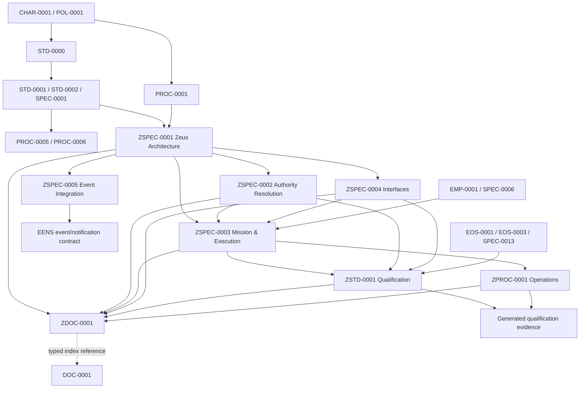

# Zeus Controlled Documentation Architecture

Status: proposed engineering architecture. This document is not controlled,
approved, active, published, or authoritative. It makes no governance,
authority, ownership, or lifecycle change.

## 1. Architectural objective

Zeus needs durable documentation for its interfaces, runtime behavior,
qualification, operations, and integrations. That documentation must remain
subordinate to the existing Engineering Governance framework and must not
become an alternate source of approval, work authority, controlled-document
lifecycle, or policy.

The proposed architecture uses a strict rule:

> Engineering Governance owns why, who may authorize, and the controlled
> lifecycle. The responsible engineering subsystem owns what its interface
> means and how it behaves. Runtime records and evidence state what happened.

“Zeus authority” below means information ownership for Zeus technical
contracts. It does not mean Zeus possesses independent human or governance
authority.

## 2. Observed framework

The repository currently assigns:

- `CHAR-0001`, `POL-0001`, `STD-0000`, `STD-0001`, and `STD-0002` to
  Engineering Governance;
- controlled-document representation to `SPEC-0001`, owned by the EOS Program;
- controlled publication and qualification processes to `PROC-0005` and
  `PROC-0006`, owned by Engineering Governance;
- work execution procedure to `PROC-0001`, owned by Engineering Governance;
- EMP architecture and work-registry semantics to `EMP-0001` and `SPEC-0006`;
- platform construction and engineering-knowledge architecture to `SPEC-0007`
  and `SPEC-0010`, owned by the Engineering Platform;
- controlled mission assurance language to `SPEC-0013`, owned by the EOS
  Program;
- Zeus runtime, operator, authority-resolution, admission, execution, and
  qualification material primarily under `engineering/`.

The current Zeus material is rich but structurally mixed: architecture,
operations, test contracts, progress records, CLI guidance, runtime schemas,
work-package state, and evidence are separated by repository directory rather
than by one documented ownership and authority model.

## 3. Information-domain allocation

| Domain | Authoritative information | Must reference, not duplicate |
|---|---|---|
| Engineering Governance | Charter, policy, approval authority, work authorization, controlled-document classes, lifecycle states/transitions, publication and qualification procedure | Zeus runtime algorithms, EMP coordination detail, EENS transport detail |
| EOS | System-wide operational principles, context reconstruction, assurance language, state freshness, persistence profile, cross-subsystem invariants | Governance authority and project technical truth |
| Zeus | CLI contracts, authority-resolution mechanics, admission protocol, mission/execution runtime, operator interaction, Zeus failure taxonomy, runtime state machines | Governance approval rules, controlled lifecycle, EMP portfolio state, EENS event ownership |
| EMP | Portfolio/work coordination model, work registry, planning and readiness projections, mission scheduling inputs | Governance authorization, Zeus execution decisions, project technical truth |
| EENS | Event envelope, ordering, delivery, replay, checkpoint, notification, and retention contracts | Authorization decisions and source-domain lifecycle truth |
| Project repositories | Product/service architecture, project requirements, technical baselines, project-local operating procedures and evidence | Portfolio coordination and enterprise governance text |
| Generated engineering evidence | Immutable observations, commands, inputs, outputs, digests, decisions made by authorized actors, qualifications, failures | Normative policy, reusable procedure, or current state |

If the same fact appears in more than one domain, exactly one source is
normative. Other documents use a typed reference plus a version or immutable
locator.

## 4. Proposed Zeus documentation domains

1. **Architecture** — component boundaries, data flow, trust boundaries, state
   ownership, and failure containment.
2. **Interfaces** — CLI, API, bundle, admission, execution, authority
   resolution, event-production, and repository contracts.
3. **Runtime semantics** — state machines, idempotency, recovery,
   reconciliation, replay consumption, and fail-closed behavior.
4. **Operations** — operator procedures, diagnostics, incident/recovery
   actions, and deployment profiles within already granted authority.
5. **Qualification** — conformance requirements, test profiles, capability
   matrices, and release-readiness criteria.
6. **Security and authority resolution** — verification mechanics, identity
   binding, provenance, signature, scope, freshness, and revocation processing;
   never authority origination.
7. **Reference** — CLI manuals, error catalogues, configuration keys, and
   schema indexes derived from normative contracts.
8. **Evidence and history** — execution-specific results and reconstruction
   records, not normative requirements.

## 5. Candidate controlled-document inventory

The following are candidates for later controlled construction. Their IDs are
reserved recommendations only and are not assigned by this architecture.

| Candidate | Proposed class/ID family | Single information owner | Approval authority | Scope |
|---|---|---|---|---|
| Zeus Architecture Specification | `ZSPEC-0001` | Zeus Engineering | Engineering Governance | Components, boundaries, trust model, subsystem relationships |
| Zeus Authority Resolution Specification | `ZSPEC-0002` | Zeus Engineering | Engineering Governance | Deterministic verification mechanics; consumes governance authority records |
| Zeus Mission and Execution Runtime Specification | `ZSPEC-0003` | Zeus Engineering | Engineering Governance | Admission, mission state, dispatch/execution protocol, idempotency, recovery |
| Zeus Interface Specification | `ZSPEC-0004` | Zeus Engineering | Engineering Governance | CLI/API, result envelope, exit taxonomy, Authorization Bundle |
| Zeus Event Integration Specification | `ZSPEC-0005` | Zeus Engineering | Engineering Governance | Zeus producer semantics and obligations; references the separately EENS-owned transport contract |
| Zeus Qualification Standard | `ZSTD-0001` | Zeus Assurance | Engineering Governance | Zeus conformance profiles and release gates subordinate to Governance qualification |
| Zeus Operations Procedure | `ZPROC-0001` | Zeus Operations | Engineering Governance | Normal operation, diagnostics, recovery, escalation boundaries |
| Zeus Controlled Document Index | `ZDOC-0001` | Zeus Documentation | Engineering Governance | Zeus-only index and typed links into `DOC-0001` |
| Zeus Configuration Reference | `ZREF-0001` or generated reference | Zeus Engineering | Engineering Governance | Non-secret keys, defaults, compatibility, derivation provenance; omit controlled class if purely generated |

The architecture does not recommend a Zeus charter or Zeus governance policy.
Those would duplicate superior authority. It also does not recommend Zeus
copies of the Engineering Work Order, controlled publication, document
lifecycle, persistence, or governance qualification procedures.

## 6. Proposed hierarchy

```text
Engineering Governance authority
├── CHAR-0001 / POL-0001
├── STD-0000 documentation architecture
├── STD-0001 lifecycle / STD-0002 persistence
├── PROC-0001 work execution
├── PROC-0005 publication / PROC-0006 qualification
└── SPEC-0001 controlled-document representation
    └── Proposed Zeus controlled family
        ├── ZDOC-0001 Zeus index
        ├── ZSPEC-0001 architecture
        ├── ZSPEC-0002 authority-resolution mechanics
        ├── ZSPEC-0003 mission/execution runtime
        ├── ZSPEC-0004 interfaces
        ├── ZSPEC-0005 event integration
        ├── ZSTD-0001 qualification
        └── ZPROC-0001 operations
            ├── schemas and generated reference
            ├── test/qualification profiles
            ├── deployment profiles
            └── engineering evidence
```

The Zeus family conforms to the governance documents. It does not sit beside
or above them.

## 7. Documentation dependency graph



Arrows mean “depends on” or “produces.” They do not transfer authority.

## 8. Ownership matrix

| Information object | Accountable owner | Maintainer/producer | Authoritative repository class |
|---|---|---|---|
| Governance authority and approval rules | Engineering Governance | Governance maintainers | `docs/` controlled governance |
| Controlled-document lifecycle/publication | Engineering Governance | Governance/EOS tooling maintainers | `docs/standards`, `docs/procedures` |
| Controlled representation | EOS Program | EOS documentation/tooling | `docs/specifications` |
| Zeus architecture and interfaces | Zeus Engineering | Zeus maintainers | proposed `docs/zeus` controlled family |
| Zeus operational procedure | Zeus Operations | Zeus operators/maintainers | proposed `docs/zeus/procedures` |
| Zeus qualification contract | Zeus Assurance | qualification maintainers | proposed `docs/zeus/standards` |
| EMP portfolio/work coordination | Engineering Management Platform | EMP maintainers | `docs/emp`, EMP specifications |
| EOS system-wide invariants | EOS Program | EOS maintainers | `docs/eos`, EOS specifications |
| EENS delivery semantics | EENS service owner | EENS maintainers | future classified service specification |
| Project technical truth | Project owner | project maintainers | project repository |
| Runtime state | Owning runtime component | runtime | `engineering/.../runtime` or external state store |
| Engineering evidence | Executing/qualifying activity | evidence producer | `engineering/evidence` then governed persistence |
| Repository-wide controlled index | Engineering Governance | document registrar | `DOC-0001` |
| Zeus controlled index | Zeus Documentation | Zeus document registrar | proposed `ZDOC-0001`, indexed by `DOC-0001` |

Every proposed object has one accountable information owner. Approval authority
remaining Engineering Governance does not make Engineering Governance the
technical-content owner.

## 9. Authority matrix

| Decision | Engineering Governance | Zeus | EMP | EOS | EENS | Project |
|---|---|---|---|---|---|---|
| Establish policy/authority | Accountable/authoritative | No authority; consume | Consume | Consume | Consume | Consume |
| Approve controlled Zeus document | Accountable/authoritative | Propose and provide technical evidence | Consulted | Consulted | Consulted where affected | Consulted where affected |
| Define Zeus technical contract | Constrain/approve | Accountable content owner | Consulted | Consulted | Consulted | Consulted |
| Authorize engineering work | Accountable under existing framework | Resolve/verify only | Coordinate only | Record/reconstruct | Transport event only | Request/execute under authority |
| Change controlled lifecycle | Accountable under existing framework | Request/validate only | No | Support persistence/validation | Record event only | No |
| Decide Zeus runtime result | No implementation ownership | Accountable within authorized contract | Supply coordination inputs | Supply invariants/context | Persist/transport result | Supply project facts |
| Decide portfolio coordination state | Govern constraints | Consume | Accountable | Consume | Transport | Supply facts |
| Decide project technical truth | Govern constraints | Consume | Reference | Reconstruct | Transport | Accountable |
| Publish event | Govern authorization boundary | Own Zeus event meaning | Own EMP event meaning | Own EOS event meaning | Own envelope/delivery | Own project event meaning |

No row has two authoritative decision owners. Shared interfaces are split by
information field, not co-owned.

## 10. Repository placement

Recommended eventual controlled placement:

```text
docs/
  zeus/
    ZDOC-0001-...md
    specifications/ZSPEC-....md
    standards/ZSTD-....md
    procedures/ZPROC-....md
engineering/
  docs/
    architecture/       # non-controlled design/explanatory material
    cli/                # generated/operator reference
  schemas/ or domain-owned schema directories
  operations/           # deployment/runtime profiles and runbooks until classified
  tests/                # executable qualification assets
  evidence/             # mission-specific records
  work-orders/          # execution packages and runtime evidence
services/eens/
  docs/                 # EENS implementation/reference material
```

Controlled Zeus documents belong under `docs/zeus` so existing controlled
validators, index rules, lifecycle, and publication mechanisms remain the one
framework. They should not be placed under `engineering/docs`, because that
currently holds implementation-facing material and could obscure lifecycle
status. No move is authorized by this proposal.

Schemas should remain beside their owning interface or in a future shared
schema registry with an unambiguous owning document. Generated manuals and
tables must contain derivation provenance and point back to the normative
source.

## 11. Traceability model

Each future controlled Zeus document should carry existing `SPEC-0001`
metadata plus:

- one `owner`;
- Engineering Governance as approval authority where required by the existing
  framework;
- `governed_by` links to superior authority;
- typed `depends_on`, `implements`, `constrains`, and `indexed_by` links;
- `information_scope`, including explicit exclusions;
- a stable document/revision locator;
- schema, implementation, qualification, and evidence relationships.

Recommended trace chain:

```text
governance requirement
  -> Zeus controlled requirement ID
  -> interface/schema clause
  -> implementation component
  -> qualification case
  -> immutable result/evidence
  -> controlled publication locator
```

Normative requirement IDs should be stable within a major revision, for
example `ZSPEC-0004-REQ-0017`. Test IDs should reference them directly.
Generated evidence records the exact revision/digest tested.

`ZDOC-0001` should index only the Zeus family. `DOC-0001` remains the
repository-wide authoritative index and references `ZDOC-0001`; the two
indexes must not independently own lifecycle facts.

## 12. Versioning and publication

- Use the existing controlled-document version/revision model without a Zeus
  exception.
- Increment major version for incompatible contract changes; minor version for
  backward-compatible normative additions or clarification as existing
  governance permits.
- Version schemas explicitly and bind each schema version to a normative
  document revision.
- Version generated reference by source revision/digest, not independently.
- Keep runtime state and evidence immutable or append-only according to their
  owning persistence rules; do not assign them normative document versions.
- Publish Zeus controlled candidates only through existing qualification,
  approval, publication, persistence, and index reconciliation procedures.
- Use one atomic publication set when cross-document changes would otherwise
  create an invalid dependency graph.

This architecture recommends publication mechanics; it authorizes none.

## 13. Qualification strategy

Qualification should have five layers:

1. **Governance conformance** — no authority duplication, valid ownership,
   lifecycle, metadata, and relationship types.
2. **Contract conformance** — prose/schema/CLI/runtime equivalence and backward
   compatibility.
3. **Dependency closure** — every normative reference resolves to the intended
   revision and no cycle violates hierarchy.
4. **Behavioral evidence** — positive, negative, corruption, ambiguity,
   idempotency, recovery, and fail-closed tests.
5. **Reconstruction** — an independent engineer can resolve authority,
   implementation, tests, and evidence from immutable locators.

Qualification produces a recommendation and evidence; it does not approve or
publish. Engineering Governance retains disposition under existing rules.

## 14. Migration roadmap

### Phase 0 — classify and freeze scope

- Approve no documents yet.
- Assign accountable content owners.
- Inventory every Zeus artifact and classify it as normative candidate,
  explanatory, operational profile, generated reference, runtime state, or
  evidence.
- Record duplicate or contradictory statements.

Exit criterion: every artifact has one classification and proposed owner.

### Phase 1 — establish the root contracts

- Draft `ZSPEC-0001` and `ZDOC-0001`.
- Establish the document namespace through the existing documentation model.
- Define typed links to Governance, EOS, EMP, EENS, and projects.

Exit criterion: proposed hierarchy is acyclic and every authority claim
resolves upward to existing Governance authority.

### Phase 2 — extract normative interfaces

- Draft authority-resolution, mission/runtime, interface, and event-integration
  specifications from existing engineering material.
- Replace duplicated governance prose with typed references.
- Bind schemas and CLI references to requirements.

Exit criterion: one normative source per technical fact and traceable
implementation/test links.

### Phase 3 — qualification and operations

- Draft Zeus qualification standard and operations procedure.
- Reconcile existing PMCT, assurance, runtime, and operator documents.
- Execute negative and reconstruction qualification.

Exit criterion: qualification evidence demonstrates no duplicate authority and
complete dependency closure.

### Phase 4 — controlled adoption

- Seek separate authorization for controlled-document construction and
  publication.
- Publish an atomic coherent set through existing procedures.
- Update `DOC-0001` once, referencing `ZDOC-0001`.

Exit criterion: controlled locators and index relationships validate.

### Phase 5 — compatibility cleanup

- Mark superseded explanatory sources as historical or derived without
  deleting evidence.
- Remove duplicate normative statements only after all inbound links migrate.
- Monitor unresolved or stale references.

Exit criterion: zero ambiguous normative owners and complete historical
reconstruction.

## 15. Gap analysis

| Gap | Impact | Priority | Proposed resolution |
|---|---|---:|---|
| No controlled Zeus document family/namespace | Zeus contracts lack a clear controlled home | P1 | Decide namespace and add it through existing governance process |
| Mixed normative and explanatory Zeus material | Conflicting-source risk | P1 | Classify and extract one normative source per fact |
| No Zeus document index | Weak dependency discovery | P1 | Draft `ZDOC-0001`, subordinate to `DOC-0001` |
| Authority ownership specification is implementation-side | High-impact claims may be mistaken for governance authority | P1 | Controlled Zeus spec should reference Governance authority and define verification mechanics only |
| Schema/prose/implementation drift controls are incomplete | Silent contract divergence | P1 | Add automated conformance matrix |
| EENS interface ownership is split but undocumented | Event meaning may be conflated with delivery | P2 | Field-level producer/transport ownership contract |
| Generated CLI/reference provenance is inconsistent | Operators may use stale guidance | P2 | Embed source revision/digest and generation command |
| Evidence volume lacks a durable catalogue | Reconstruction cost and duplicate findings | P2 | Evidence index generated from immutable metadata |
| Project/portfolio/runtime state precedence is implicit | Reconciliation ambiguity | P2 | Controlled precedence and reference rules without copying state |

## 16. Risks and rejected alternatives

### Principal risks

- Zeus documents could accidentally restate approval or lifecycle rules and
  become a shadow governance system.
- A Zeus-specific namespace could bypass repository-wide validation if treated
  as a separate framework.
- Co-owned integration documents could leave conflicts unresolved.
- Moving existing material before classification could break historical links.
- Generated references could be mistaken for normative sources.
- Large atomic publication sets may be hard to qualify; small sets may create
  temporarily inconsistent dependencies.

### Rejected alternatives

1. **Put all Zeus material in existing Governance documents.** Rejected because
   implementation contracts would burden Governance ownership and couple
   policy revisions to runtime evolution.
2. **Create a parallel Zeus governance hierarchy.** Rejected because it
   duplicates authority and lifecycle.
3. **Treat everything under `engineering/` as controlled.** Rejected because
   evidence, runtime state, tests, and explanatory documents have different
   lifecycle and ownership.
4. **Move files immediately into `docs/zeus`.** Rejected because classification,
   reference migration, authorization, qualification, and publication must
   precede restructuring.
5. **Co-own interface documents.** Rejected because shared ownership obscures
   final accountability. Interfaces use field/section ownership or two linked
   contracts.
6. **Duplicate Governance clauses for self-contained Zeus documents.** Rejected
   because copied authority text becomes stale and ambiguous; typed references
   preserve one source.
7. **Use unversioned generated documentation as the operator contract.**
   Rejected because derivation cannot be reconstructed.

## 17. Validation invariants

The architecture is internally valid when:

- each candidate document has exactly one accountable information owner;
- every approval and controlled-lifecycle decision resolves to Engineering
  Governance under the existing framework;
- no Zeus document originates authority;
- every cross-domain fact has one normative source;
- every dependency is typed and points toward a superior or peer-owned
  interface without an authority cycle;
- `DOC-0001` remains the repository-wide index;
- migration has no phase that requires an unpublished candidate to govern
  production behavior;
- evidence and generated reference cannot override normative sources.
