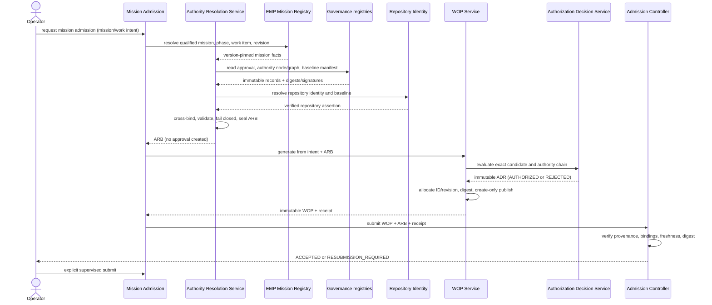
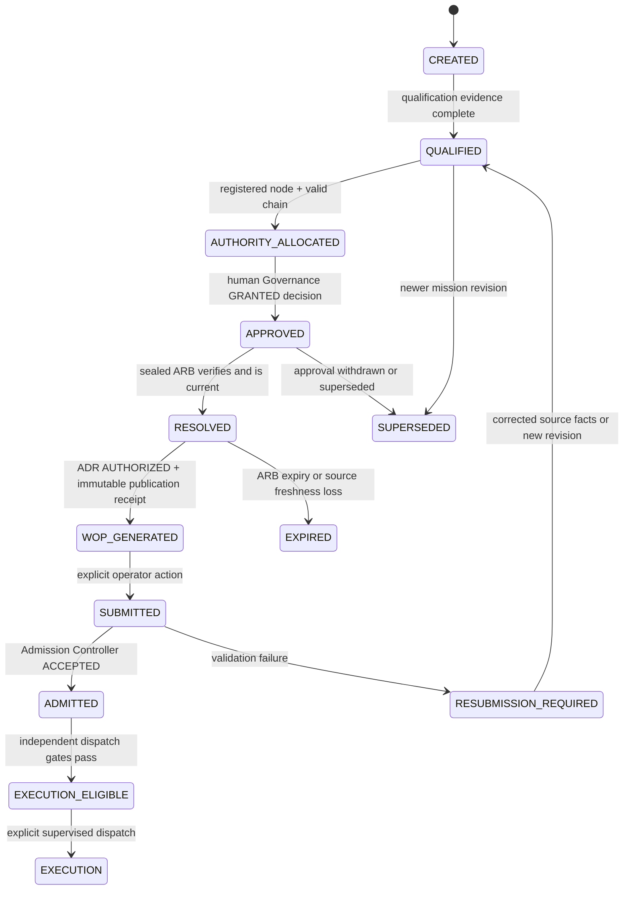

# ZEUS-P2-002 Authority Resolution Architecture Specification

Date: 2026-07-25
Status: Proposed operational architecture; implementation and activation require separate authority
Baseline inspected: `5ebaa32` (`main`, synchronized with `origin/main`)
Mission: ZEUS-P2-002 Operational WOP Authority Resolution Framework

## 1. Decision and boundary

Operational WOP generation shall consume one immutable, validated
**Authority Resolution Bundle (ARB)**. The bundle is assembled by an Authority
Resolution Service (ARS) hosted in the EMP management plane and exposed to
Mission Admission. ARS resolves facts from their authoritative owners; it does
not approve, invent identifiers, mutate source records, submit WOPs, or grant
execution authority.

Qualification mode remains the existing explicit-input path. Its output is
always `review_required: true`, `automatically_submitted: false`, and is
ineligible for operational admission when any authority value is a placeholder.

```text
qualification:
Operator -> generate-wop --mode qualification + explicit references
         -> review-only candidate (never operationally admitted as resolved)

operational:
Operator -> Mission Admission -> ARS -> sealed ARB
         -> WOP Service generate -> immutable WOP -> Admission Controller
         -> accepted admission record -> explicit supervised submission
```

No component in this design autonomously approves or expands authority.

## 2. Current-state evidence

`scripts/zeus` currently requires:

| CLI input | WOP field | Current source |
| --- | --- | --- |
| `--mission` | `mission_id` | operator |
| `--phase` | `phase_id` | operator |
| `--repository` | `repository_identity` | operator |
| `--submitter` | `submitter_identity` | operator |
| `--approval-authority` | `approval.authority` | operator |
| `--approval-reference` | `approval.reference` | operator |
| `--approval-date` | `approval.date` | operator |
| `--authority-node` | `execution_package_references.authority_node_id` | operator |
| `--adr` | `execution_package_references.authorization_decision_record` | operator |
| `--immutable-wop` | `execution_package_references.immutable_wop` | operator |

`WopGenerator` creates a deterministic candidate `wop_id` and
`submission_digest`, but accepts the remaining authority references without
resolving their records. `AdmissionController` checks shape, presence,
repository equality, canonical digest, and required references, but does not
establish provenance or reject placeholder semantics. The offline authority
DAG, immutable-WOP contract, ADR schemas, and admission ledger already provide
the component contracts needed for a later implementation.

## 3. Authority inventory and exactly-one-owner matrix

“Owner” means the only subsystem allowed to originate the value. ARS may copy
and validate it but never becomes its owner.

| Artifact | Canonical field / identifier | Authoritative owner | Rationale |
| --- | --- | --- | --- |
| Approval Reference | `approval.reference` | Engineering Governance decision registry | It identifies a human governance disposition; neither EMP nor generation may create approval. |
| Approval Authority | `approval.authority` | Engineering Governance decision registry | The deciding principal is a property of the signed decision record. |
| Approval Date | `approval.date` | Engineering Governance decision registry | The disposition timestamp must be copied from the approval record. |
| Authority Node Identifier | `authority_node_id` | Governance Authority Graph Registrar | Node allocation is a controlled registration act in the one authority DAG. |
| Authorization Decision Record (ADR) | `ADR-…` | Authorization Decision Service | The evaluator owns its immutable decision record and digest; Governance owns inputs, not evaluation output. |
| Immutable WOP Identifier | `WOP-…` | WOP Service | The service binds identity to canonical payload and revision using create-only storage. |
| Submission Digest | 64-character SHA-256 | WOP Service | It is derived over the final canonical submission excluding the digest field; only the finalizer can originate it. |
| Repository Identity | canonical repository UUID/name plus locator | Repository Identity Management | Filesystem paths are mutable deployment locators, not durable identity. |
| Repository baseline | 40-character commit | Repository Identity Management | A baseline observation must be resolved from the registered repository and verified against Git. |
| Mission Identity | `mission_id` | Mission Registry (EMP system of record) | EMP already owns portfolio and mission facts; a WOP only references them. |
| Phase Identity | `phase_id` | Mission Registry | Phase membership and state are mission-management facts. |
| Work Item Identity | `work_item_id` | EMP Work Registry | It binds the package to bounded managed work. |
| Revision Identity | `(wop_id, revision)` | WOP Service, constrained by Mission Registry intent revision | WOP Service owns immutable WOP revisions; the mission registry supplies the requested intent revision. |
| Governing Controlled References | ordered baseline manifest ID and members | Engineering Governance Baseline Registrar | Governance publication determines which revisions govern; generators cannot choose them. |
| Submitter Identity | authenticated principal ID | Identity Provider / operator session service | It is an observed authenticated actor, not free text. |
| Admission Record | `ADMISSION-…` | Admission Controller | Admission owns validation outcome only and cannot originate upstream authority. |

There is no shared origination. When sources disagree, resolution fails closed;
no precedence rule silently chooses a value.

## 4. Authority object model

The normative proposed machine-readable model is
`engineering/authority/authority-resolution-bundle.schema.yaml`.

### 4.1 Authority Resolution Request

The request contains only operator-selectable intent:

- registered `mission_id`;
- requested intent or managed `work_item_id`;
- authenticated principal/session;
- requested repository target; and
- mode (`operational` or `qualification`).

Operational requests cannot carry overrides for approval, authority-node, ADR,
immutable-WOP, governing baseline, repository baseline, or digest.

### 4.2 Authority Resolution Bundle

An ARB contains:

- stable `resolution_id`;
- mode and issuance/expiry;
- mission, phase, work-item, and intent revision;
- registered repository identity, locator, and baseline commit;
- approval record identity, authority, date, decision, authorized lifecycle,
  scope digest, and signature/verification status;
- authority-node identity, graph version, resolved chain, capabilities, and
  resolution digest;
- governing baseline manifest and exact controlled reference revisions;
- authenticated submitter;
- reservations for WOP identity and ADR evaluation;
- one provenance locator and content digest per resolved fact;
- bundle digest and resolver version.

The bundle is acceptable only when every source record is immutable or
version-pinned, every digest verifies, the approval is `GRANTED`, the authority
chain terminates at the registered root without expansion, the mission and
repository baseline are current, and the bundle is unexpired.

### 4.3 Finalization products

The WOP Service exchanges the ARB reservations atomically:

1. allocate the immutable WOP ID/revision;
2. render canonical content from intent plus the ARB;
3. request an ADR evaluation bound to the exact WOP payload;
4. embed the ADR reference;
5. calculate the final submission digest;
6. publish create-only WOP bytes; and
7. return a publication receipt.

The ADR may only report `AUTHORIZED` or `REJECTED`; it cannot create approval.
A rejected ADR prevents publication/admission.

## 5. Service architecture and integration assessment

| Candidate location | Fit | Decision |
| --- | --- | --- |
| EMP | Owns mission/work facts and management-plane coordination | **Host ARS orchestration here**, behind a narrow port; do not make EMP owner of governance or WOP facts. |
| Zeus Runtime | Natural caller and operator surface | Client only. Hosting would mix presentation/orchestration with authority origination. |
| Mission Controller | Knows selection and qualification state | Calls Mission Admission and consumes results; does not resolve or approve. |
| Admission Controller | Existing fail-closed validation/ledger | Validate ARB/WOP bindings and decide admission only; resolving authority here would combine evidence production with acceptance. |
| WOP Service | Owns immutable package identity and digest | Finalizer and immutable publisher, not approval or mission owner. |
| Engineering Governance | Owns decisions, graph registration, controlled baselines | Source adapters are read-only from ARS; Governance never generates or submits WOPs. |
| Repository Identity Management | Owns registered repository and observed baseline | Supplies a signed/versioned repository assertion. |

ARS uses owner-specific read ports and returns a sealed snapshot. A source
adapter must expose `get(id, revision)`, `verify(digest/signature)`, and
`current(id)`; it has no create/update operation. The service records an
append-only resolution audit event and supports deterministic replay from
version-pinned source records.

Recommended repository location for a later implementation:

```text
scripts/lib/emp/authority_resolution.py       orchestration and validation
scripts/lib/emp/authority_sources.py          read-only ports
scripts/lib/emp/wop_service.py                identity/finalization/publication
engineering/authority/                       ARB schema and fixtures
engineering/evidence/authority-resolution/   create-only audit bundles
```

No existing controller should import the proposed service until a separately
authorized implementation mission activates the contract.

## 6. Operational WOP generation sequence



The operator’s final submission action is mandatory. `ACCEPTED` is admission
evidence, not approval and not execution authority.

## 7. Admission state machine



### Transition evidence

| Transition | Required condition | Required evidence |
| --- | --- | --- |
| Created → Qualified | scope, repository, prerequisites, and qualification pass | qualification record bound to mission revision/baseline |
| Qualified → Authority Allocated | one registered node and valid child-to-root path | graph version, resolution digest, capability subset proof |
| Authority Allocated → Approved | explicit human decision grants the exact scope/lifecycle | signed approval decision record |
| Approved → Resolved | all owners agree; sources current; no placeholders | sealed ARB and provenance map |
| Resolved → WOP Generated | ADR authorizes exact payload; create-only publication succeeds | ADR, immutable WOP, publication receipt |
| Generated → Submitted | authenticated operator explicitly submits | submission event and digest |
| Submitted → Admitted | schema, provenance, freshness, identity, digest, and binding checks pass | immutable `ACCEPTED` admission record |
| Admitted → Execution Eligible | approvals, dependencies, leases, resources, and dispatch policy pass | dispatch evaluation/lease; admission alone is insufficient |
| Eligible → Execution | explicit supervised assignment | execution assignment bound to WOP digest and approval |

Any mutation to scope, mission revision, repository baseline, governing
baseline, approval, authority graph, or WOP bytes invalidates downstream
evidence and requires a new resolution/revision. There is no in-place repair.

## 8. Authority lifecycle

| Stage | Rule |
| --- | --- |
| Creation | Only the designated owner allocates an identifier in a create-only namespace. |
| Validation | Schema, signature/digest, parent chain, owner, scope, lifecycle, and cross-object bindings are checked independently. |
| Approval | Human Governance creates a signed decision; services may request or verify but never grant it. |
| Publication | Publisher writes canonical bytes and a receipt; publication proves persistence, not approval. |
| Immutability | Published identity+revision bytes are append-only. Corrections create a new revision. |
| Supersession | A new record explicitly names its predecessor; old records remain verifiable and become unusable for new admissions. |
| Archival | Retention moves records without changing identity/digest; resolvers retain read access for audit replay. |
| Auditability | Every resolution records source IDs/revisions/digests, resolver version, time, result, and reason codes. |

Revocation or expiry blocks new admission and dispatch. It does not erase
history. Active execution follows the separately defined lease/revocation
contract.

## 9. Failure and security rules

- Operational mode rejects caller-supplied authority overrides.
- Placeholder patterns (`placeholder`, `example`, `test`, `TBD`, `unknown`,
  empty or unregistered IDs) are forbidden in operational ARBs.
- One missing, stale, mutable, unsigned where required, or disagreeing source
  produces a typed rejection; ARS never falls back to qualification mode.
- Repository path equality is insufficient; registered identity and baseline
  must both verify.
- Governing references are selected by an approved baseline manifest, never by
  the generator’s hard-coded defaults.
- Cache entries are addressed by source digests and cannot outlive the
  earliest source expiry.
- Resolution, approval, admission, dispatch, and execution remain distinct
  decisions with distinct records.

## 10. Migration strategy

### Phase A — contract and fixtures

Add ARB schema validation, valid/invalid fixtures, provenance checks, and
placeholder rejection without changing `generate-wop`. Mark all existing
explicit examples as `qualification`.

### Phase B — read-only shadow resolution

Implement owner adapters and compare a shadow ARB with explicitly supplied
qualification values. Disagreement is evidence only and fails any attempted
operational use. No live controller consumes the result.

### Phase C — operational opt-in

Add mutually exclusive interfaces:

```text
zeus generate-wop --mode qualification <existing explicit fields>
zeus generate-wop --mode operational --mission ID [--work-item ID]
```

Operational mode accepts no authority fields and requires a sealed ARB.
Qualification defaults preserve current behavior and output flags for backward
compatibility.

### Phase D — admission enforcement

Admission requires `resolution_id`, ARB digest, immutable publication receipt,
ADR binding, non-placeholder provenance, and current source verification for
operational packages. Legacy packages remain validation/qualification inputs
but cannot claim operational resolution.

### Phase E — remove ambiguity

After telemetry shows no operational callers using explicit fields, make
`--mode` mandatory. Do not remove qualification support. Archive shadow
comparisons and publish migration evidence.

Rollback at every phase disables operational consumption and returns to the
review-only path; it never weakens admission checks or converts placeholders
into authority.

## 11. Repository integration plan and backlog

| Priority | Work item | Acceptance evidence |
| --- | --- | --- |
| P0 | Approve ARB contract and owner interfaces | controlled design disposition; zero dual-owned fields |
| P0 | Establish repository identity registry | stable ID/path/baseline assertions and mismatch fixtures |
| P0 | Implement read-only Governance/Mission/graph adapters | owner fixtures, signature/digest tests, no write methods |
| P0 | Implement ARS validator and append-only audit ledger | deterministic replay and fail-closed test matrix |
| P0 | Implement WOP identity reservation/finalization | collision, idempotency, revision, and digest tests |
| P0 | Extend admission with ARB/provenance checks | placeholders and stale/superseded sources rejected |
| P1 | Add explicit dual CLI modes | existing qualification tests pass unchanged; operational rejects overrides |
| P1 | Shadow qualification comparison | disagreement reports with no authority effect |
| P1 | Supervised end-to-end qualification | created-to-admitted evidence; no automatic submission/execution |
| P2 | Operational activation and migration closeout | approved activation, rollback drill, archived evidence |

## 12. Controlled-document reconciliation

This design affects the future behavior described by `EMP-0001`, `SERVICE-0002`,
`PHASE-0001`, `PROJ-0001`, `PROC-0001`, `SPEC-0006`, and the active WOP,
authorization, admission, authority-DAG, lifecycle, and dispatch schemas.

No controlled record is revised by this architectural mission. Their approved
metadata and lifecycle state remain intact. A later controlled publication
must:

1. revise EMP/service contracts to name ARS and the information-owner ports;
2. revise the WOP/admission specifications to require ARB provenance in
   operational mode;
3. register the ARB schema and this design in `DOC-0001`;
4. reconcile PHASE/PROJ state only when implementation is separately
   authorized and qualified; and
5. publish the Governance disposition that activates, rejects, or amends this
   proposal.

This explicit pending-publication disposition avoids representing this
unapproved proposal as current Governance authority.

## 13. Acceptance traceability

| Criterion | Design evidence |
| --- | --- |
| Every identifier has one source | Section 3 owner matrix |
| No manual operational authority IDs | ARB-only operational interface, Sections 1 and 10 |
| Qualification placeholders preserved | Separate review-only mode, Sections 1 and 10 |
| Workflows separated | Distinct diagrams, modes, and admission rules |
| EMP/WOP/Governance/admission integration | Sections 4–7 |
| Controlled documentation reconciled | Section 12 impact and publication disposition |

## 14. Non-authority statement

This specification is architecture and planning evidence. It creates no
approval, authority node, ADR, immutable operational WOP, admission,
submission, dispatch, execution, or controlled-publication authority.
